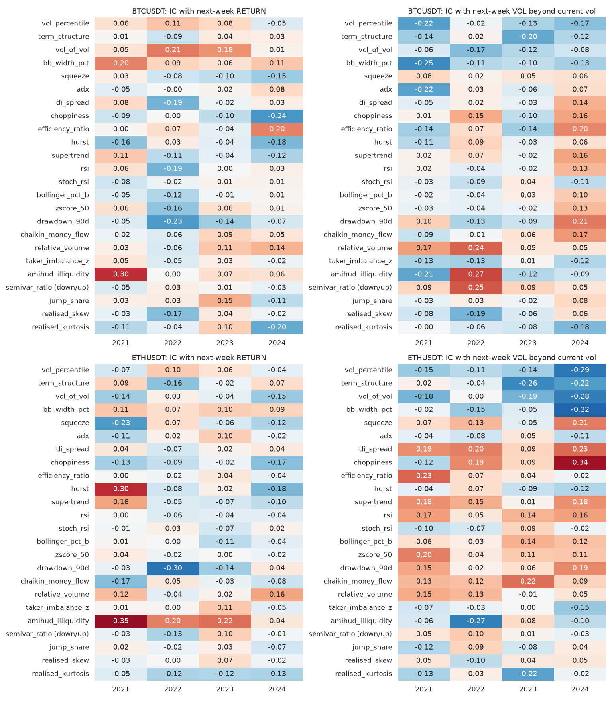
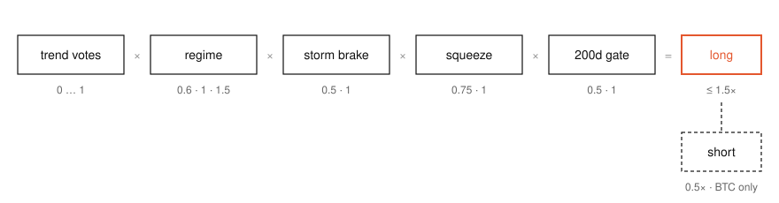
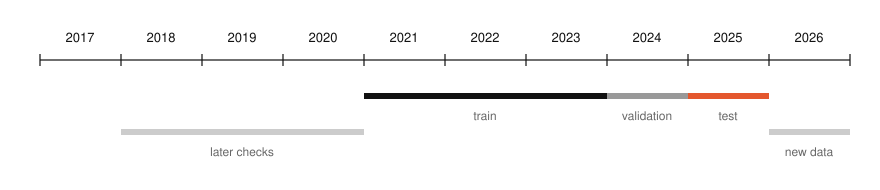
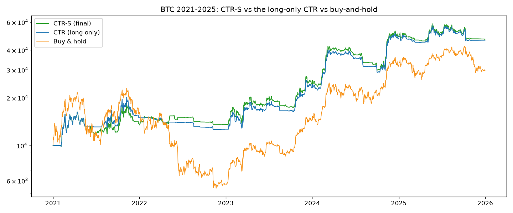
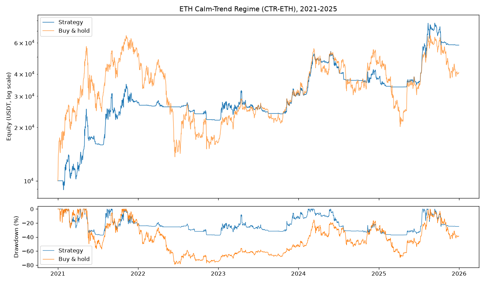
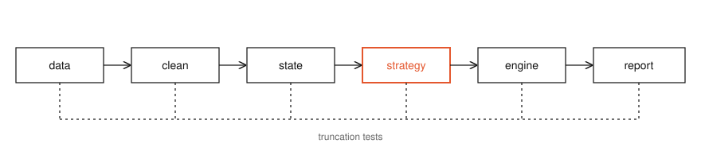

# Calm-Trend Regime (CTR): BTC/USDT and ETH/USDT strategies

Two systematic daily strategies for Bitcoin and Ether, with the in-house backtest engine, the data research behind them and a reproducible system that runs the frozen strategies on any new data.

## How to reproduce the results

| Option | You need | Commands |
|---|---|---|
| **A · Python (recommended)** | Python 3.12 or newer | `make …` on macOS / Linux, or `python run.py …` anywhere |
| **B · Docker** | Docker only | `docker …` |

Both options give exactly the same numbers.

### Step 0 · Install what you need (skip anything you already have)

<details>
<summary><b>Install Python (for Option A)</b></summary>

Any version from **3.12** upwards works; the published numbers were produced with 3.14.

| System | How |
|---|---|
| **Windows** | Download the installer from [python.org/downloads](https://www.python.org/downloads/) and run it. **Tick "Add python.exe to PATH"** on the first screen. Alternative: `winget install Python.Python.3.13` in PowerShell. |
| **macOS** | Download the macOS installer from [python.org/downloads](https://www.python.org/downloads/), or with Homebrew: `brew install python@3.13` |
| **Ubuntu / Debian** | `sudo apt update && sudo apt install python3 python3-venv python3-pip make` (Ubuntu 24.04 and newer ship Python 3.12+; on older releases install a newer Python from [python.org](https://www.python.org/downloads/) or with `pyenv`) |
| **Fedora** | `sudo dnf install python3 python3-pip make` |

Check it in a new terminal: `python --version` (Windows) or `python3 --version` (macOS / Linux). It must print 3.12 or higher. macOS and Linux usually have `make` already; on macOS, `xcode-select --install` adds it if missing.
</details>

<details>
<summary><b>Install Docker (for Option B)</b></summary>

| System | How |
|---|---|
| **Windows** | Install [Docker Desktop](https://www.docker.com/products/docker-desktop/). It turns on WSL 2 if needed and may ask for a restart. **Start Docker Desktop** and wait until it says it is running. |
| **macOS** | Install [Docker Desktop](https://www.docker.com/products/docker-desktop/) (choose Apple silicon or Intel), then open it from Applications. |
| **Linux** | `curl -fsSL https://get.docker.com \| sh`, then `sudo usermod -aG docker $USER` and log out and back in, so `docker` works without `sudo`. |

Check it: `docker run --rm hello-world` must print "Hello from Docker!".
</details>

### Step 1 · Unzip and open a terminal in the folder

```bash
unzip ctr_codebase.zip        # or right-click → Extract All (Windows) / double-click (macOS)
cd ctr                        # every command below runs from this folder
```

### Step 2 · Option A: Python

**A1 · With `make` (macOS / Linux): three commands.**

```bash
make install       # creates .venv and installs everything (about a minute)
make test          # runs the 82 tests
make reproduce     # rebuilds every published result into results/
```

**A2 · Without `make` (Windows, or anywhere).**

```bash
python -m venv .venv                     # 1. create an isolated environment (macOS / Linux: python3)
source .venv/bin/activate                # 2. activate it (Windows: see the table below)
pip install -e ".[dev]"                  # 3. install the project and its libraries
python run.py selftest                   # 4. run the 82 tests
python run.py reproduce                  # 5. rebuild every published result into results/
```

| Activating the environment (step 2) | Command |
|---|---|
| macOS / Linux | `source .venv/bin/activate` |
| Windows PowerShell | `.venv\Scripts\Activate.ps1`. If it is blocked, first run `Set-ExecutionPolicy -Scope Process RemoteSigned` |
| Windows Command Prompt | `.venv\Scripts\activate.bat` |

The exact library versions behind the published numbers are pinned in `requirements-lock.txt`. To install exactly those, replace step 3 with `pip install -r requirements-lock.txt "setuptools>=69"` and then `pip install --no-deps --no-build-isolation -e .`.

### Step 2 · Option B: Docker

```bash
docker build -t ctr .                                              # 1. build the image (2–4 minutes the first time)
docker run --rm ctr selftest                                       # 2. run the 82 tests
docker run --rm -v "$PWD/results:/app/results" ctr reproduce       # 3. rebuild every published result into results/
```

The same three steps with `make`: `make docker-build`, `make docker-test`, `make docker-reproduce`.

- **Windows:** in PowerShell, write `${PWD}` instead of `$PWD`; in Command Prompt, write `%cd%`.
- **macOS and Windows:** Docker Desktop must be running first.

### Step 3 · Check the results

The test step should end with `80 passed, 2 skipped`. The two skipped tests cover research-only indicators that need the optional research libraries; with `pip install -e ".[research]"` all 82 pass.

`reproduce` rewrites `results/btc/` and `results/eth/`. For 2021–2024, 2025 and 2021–2025, that means:
- all 15 required metrics;
- trade history and fills;
- equity curves, charts, and quarterly and yearly tables;
- a `summary.md` per coin.

You should get exactly:

| | 2021–2024 | 2025 | 2021–2025 |
|---|---|---|---|
| BTC CTR-S total return / Sharpe | +388.85% / 1.16 | −5.13% / −0.05 | +368.40% / 0.98 |
| ETH CTR-ETH total return / Sharpe | +274.14% / 0.90 | +54.88% / 1.23 | +481.69% / 0.96 |

Open `results/btc/summary.md` and `results/eth/summary.md` for every metric.

**The data:**
- **Raw candles:** the competition candles are in `data/raw/`.
- **Cleaned data:** the cleaned files in `data/processed/` are fully determined by the raw ones. If that folder is empty (as in the size-limited submission zip), the first command that needs it rebuilds it in a few seconds, and the Docker build does it automatically.
- **Identical:** the rebuilt files are byte-identical to the published ones.

## How to check the strategies on an unknown CSV file

Give the system any candle file. It cleans the data, checks it for look-ahead, runs the frozen strategy, analyses the market, and tells you the position it would take next.

### Option A: Python

**With `make`:**

```bash
make run DATA=path/to/prices.csv ASSET=eth
make run DATA=path/to/prices.csv ASSET=btc START=2026-01-01 END=2026-09-30
```

**With `python run.py` (after the install in Option A above):**

```bash
python run.py path/to/BTCUSDT_new.csv                          # BTC or ETH is read from the file name
python run.py path/to/prices.csv eth                           # or name the asset yourself
ctr run path/to/prices.csv --asset btc --start 2026-01-01 --end 2026-09-30
```

| Setting | `make` | `run.py` / `ctr` | Meaning |
|---|---|---|---|
| file | `DATA=…` | first argument | path to the CSV file (required) |
| asset | `ASSET=btc\|eth` | `eth` / `--asset eth` | needed only if the file name has no "BTC" or "ETH" in it |
| start | `START=2026-01-01` | `--start` | first day to evaluate; earlier rows only warm up the indicators |
| end | `END=2026-09-30` | `--end` | last day to evaluate (default: the last complete day in the file) |

### Option B: Docker

Copy the file into `data/external/` (the folder shared with the container), then run it:

```bash
cp path/to/prices.csv data/external/
make docker-run DATA=data/external/prices.csv ASSET=eth START=2026-01-01
# or directly:
docker run --rm -v "$PWD/data/external:/app/data/external:ro" -v "$PWD/runs:/app/runs" \
    ctr run data/external/prices.csv --asset eth --start 2026-01-01
```

### What the file can look like

| Format | Example header |
|---|---|
| Binance kline export | `timestamp,open,high,low,close,volume,close_time,quote_volume,trades,...` |
| Binance kline dump without a header | `1704067200000,42283.58,42554.57,...` |
| Any table with a time column and OHLC | `Date,Open,High,Low,Close,Volume` (any capitalisation) |

- **Bar length:** hourly bars (or finer, aggregated to hours) or daily bars. The system detects which.
- **Timestamps:** bar **open** times in UTC.
- **History:** include at least 200 days before `START` so the indicators are fully warmed up. With less, the run still works, and the report says so.

### What you get

A folder `runs/<asset>_<file>_<time>/` with:

| File | Contents |
|---|---|
| `report.md` | everything on one page: data quality, the 15 metrics, the comparison with buy-and-hold, the market analysis and the next decision |
| `signal_today.json` | the position the strategy wants from the next open (long, short or flat, and how large) |
| `backtest/` | metrics, every trade and fill, the equity curve, quarterly and yearly tables, charts (the same files as in `results/`) |
| `analysis/` | the data analysis: return statistics, tail index, variance ratios, volatility persistence, market states, charts |
| `manifest.json` | the input file's hash, the period and the library versions, so the run can be repeated exactly |

[Part VIII](#part-viii--test-against-unseen-data) explains how to read a run and gives a checklist for a fair out-of-sample test.

## How to test on Binance data for any dates

No file needed: give an asset, a start date and an end date. The system:
1. fetches Binance's public hourly candles, with no account or key;
2. adds **one year of extra history before the start date**, so every indicator is fully warmed up on day one;
3. evaluates the frozen strategy **exactly from the start date to the end date**.

### Option A: Python

```bash
make binance ASSET=btc START=2026-01-01 END=2026-09-30         # with make
python run.py binance btc 2026-01-01 2026-09-30                # or with run.py
ctr binance --asset eth --start 2024-01-01 --end 2024-12-31 --warmup-days 200   # full form, custom warm-up
```

### Option B: Docker

```bash
docker run --rm -v "$PWD/runs:/app/runs" ctr binance --asset btc --start 2026-01-01 --end 2026-09-30
```

**How it handles dates:**
- **Unfinished candles are dropped:** the downloaded file keeps only candles that have closed, and it is saved in `data/external/` so the run can be repeated offline.
- **End dates are capped:** an end date in the future, or today, is capped at the last finished day.

**Example**, run on 7 October 2026:

| BTC, 2026-01-01 → 2026-09-30 | CTR-S | Buy-and-hold |
|---|---|---|
| Return | **+18.6%** | −6.2% |
| Sharpe | **1.11** | 0.04 |
| Max drawdown | **−11.2%** | −39.5% |
| Trades | 8 (4 short) | |

The output is the same run folder as for a CSV file (`report.md`, `signal_today.json`, `backtest/`, `analysis/`, `manifest.json`).

## Results at a glance

| | BTC/USDT · **CTR-S** | ETH/USDT · **CTR-ETH** | |
|---|---|---|---|
| **2021–2025 return** | **+368.4%** | **+481.7%** | buy-and-hold: BTC +197.9%, ETH +306.5% |
| **Sharpe ratio** | **0.98** | **0.96** | buy-and-hold: 0.67, 0.75 |
| **Max drawdown** | **−29.6%** | **−37.3%** | buy-and-hold: −76.6%, −79.3% |
| **Closed trades** | 36 (15 short) | 21 | |
| **Style** | long up to 1.5×, short 0.5× in calm bear markets | long up to 1.5×, never short | daily decisions |

All results include 0.15% fee + slippage on every fill, next-open execution, interest on borrowed money, and start from 10,000 USDT.

---

## Contents

**Part I · The project**
1. [The task](#1-the-task)
2. [The idea in one page](#2-the-idea-in-one-page)
3. [Repository map](#3-repository-map)

**Part II · The data and what it told us**
4. [Data and cleaning](#4-data-and-cleaning)
5. [What the data told us](#5-what-the-data-told-us)
6. [Which indicators are reliable](#6-which-indicators-are-reliable)
7. [Machine learning and reinforcement learning](#7-machine-learning-and-reinforcement-learning)

**Part III · The strategies**
8. [The market-state framework](#8-the-market-state-framework)
9. [The daily decision](#9-the-daily-decision)
10. [BTC: CTR-S and its short side](#10-btc-ctr-s-and-its-short-side)
11. [ETH: CTR-ETH](#11-eth-ctr-eth)
12. [Execution settings](#12-execution-settings)
13. [Risk management, market by market](#13-risk-management-market-by-market)

**Part IV · Integrity: how look-ahead was kept out**
14. [The timing contract](#14-the-timing-contract)
15. [Data layer](#15-data-layer)
16. [Feature layer](#16-feature-layer)
17. [Engine layer](#17-engine-layer)
18. [Verification: truncation tests](#18-verification-truncation-tests)
19. [Process discipline](#19-process-discipline)
20. [What was seen, and when](#20-what-was-seen-and-when)

**Part V · Results**
21. [Required metrics, 2021–2025](#21-required-metrics-20212025)
22. [Year by year](#22-year-by-year)
23. [Beyond the competition data: 2018–2026](#23-beyond-the-competition-data-20182026)
24. [Robustness](#24-robustness)
25. [What failed](#25-what-failed)
26. [Limitations](#26-limitations)

**Part VI · How the codebase runs**
27. [Architecture](#27-architecture)
28. [Module by module](#28-module-by-module)
29. [One run, call by call](#29-one-run-call-by-call)
30. [Inside the engine loop](#30-inside-the-engine-loop)

**Part VII · Reproduce**
31. [Requirements](#31-requirements)
32. [With Docker](#32-with-docker)
33. [Without Docker](#33-without-docker)
34. [Reproduce the published results](#34-reproduce-the-published-results)
35. [The test suite](#35-the-test-suite)

**Part VIII · Test against unseen data**
36. [Getting data](#36-getting-data)
37. [Running the system](#37-running-the-system)
38. [Reading a run](#38-reading-a-run)
39. [A fair out-of-sample test: checklist](#39-a-fair-out-of-sample-test-checklist)
40. [Worked example: ETH, January 2025 to October 2026](#40-worked-example-eth-january-2025-to-october-2026)
41. [Troubleshooting](#41-troubleshooting)

**Part IX · Reference**
42. [Command reference](#42-command-reference)
43. [Make targets](#43-make-targets)
44. [Metric definitions](#44-metric-definitions)
45. [Further documents](#45-further-documents)

---

# Part I · The project

## 1. The task

The brief (`tasks/quant.pdf`) asks for two trading strategies, one for BTC/USDT and one for ETH/USDT, each tailored to its market and with its own risk management.

| Requirement | How this repository meets it |
|---|---|
| Data: Binance spot, 2021-01-01 to 2025-12-31 | Hourly candles in `data/raw/`, cleaned into `data/processed/{1h,4h,1d}` |
| 0.15% fee + slippage on **every** transaction | Charged by the engine on the notional of every fill: entries, exits, resizes, stops |
| No external backtesting or trading libraries | Engine, metrics and every indicator are written with numpy, pandas and scipy only |
| 15 required metrics per strategy | `src/backtest/metrics.py`, reported in `results/<coin>/summary.md` |
| 5-year backtest: metrics, equity curve, trade history | `results/btc/2021-2025/`, `results/eth/2021-2025/` |
| Risk plan per market: stops, risk–reward | [Section 13](#13-risk-management-market-by-market), `reports/btc_strategy.md`, `reports/eth_strategy.md` |
| Strategies are also scored on hidden data | The system in `src/system/` runs the frozen strategies on any candle file ([Part VIII](#part-viii--test-against-unseen-data)) |

The scoring rewards risk-adjusted return, narrow drawdowns, fast recovery and beating buy-and-hold in more than half of all quarters. That puts the weight on **robustness**, not on the best possible in-sample return.

## 2. The idea in one page

Three findings from our own research shaped everything:

1. **The direction of BTC and ETH is close to unpredictable; the size of their moves is not.**
   - No indicator we tested predicted next week's direction consistently.
   - Machine-learning classifiers scored AUC 0.40–0.51, where a coin flip scores 0.5.
   - Volatility, by contrast, is forecastable out of sample: a HAR model explains 60% (BTC) and 73% (ETH) of next-day log volatility in 2023.
2. **Trend-following pays in calm, orderly trends and nowhere else.**
   - Splitting days by volatility and trend efficiency, a momentum bet earned money in calm trends in 4 of 4 years.
   - In high-volatility regimes it earned roughly nothing.
3. **Most of buy-and-hold's damage happens in long bear markets.** BTC fell 77% in 2022 and stayed under water for about 780 days. Avoiding most of that matters more than catching every rally.

So each strategy splits the job in two:

- **a simple, robust trend signal decides *whether* to hold;**
- **the market's state decides *how much*.**

On BTC, a small short position is added only in the calmest, most fully confirmed bear markets.

The result is a pair of strategies that lose little in bear years and keep a large share of bull years. The table below is one continuous 2021–2025 run, cut by calendar year:

| Year | BTC CTR-S | BTC buy-and-hold | ETH CTR-ETH | ETH buy-and-hold |
|---|---|---|---|---|
| 2021 | +37.1% | +59.8% | +175.0% | +399.2% |
| 2022 | **−1.1%** | −64.2% | **−20.2%** | −67.5% |
| 2023 | +80.8% | +155.6% | +40.0% | +90.8% |
| 2024 | +99.6% | +121.3% | +21.8% | +46.3% |
| 2025 | **−4.3%** | −6.3% | **+55.4%** | −11.0% |

The strategies trail buy-and-hold in strong bull years and win heavily in bear years. Because recovering from a −65% loss needs +186%, the five-year totals end well ahead of buy-and-hold, with less than half its drawdown.

## 3. Repository map

```
.
├── run.py                      simplest entry point (wraps the ctr command)
├── pyproject.toml              package definition; installs the `ctr` command
├── requirements-lock.txt       exact library versions behind the published results
├── Dockerfile                  runtime image (code, tests, data) and a dev image (research stack)
├── docker-compose.yml          ctr, selftest, reproduce and notebook services
├── Makefile                    `make` lists every target
├── .github/workflows/ci.yml    tests, a sample run and a Docker build on every push
├── .devcontainer/              VS Code dev container
│
├── src/
│   ├── data/                   preprocess.py (competition pipeline), loader.py
│   ├── features/               indicators.py (all indicators, in-house), trend.py
│   ├── strategies/             market_state.py (framework), btc_strategy.py, eth_strategy.py, execution.py
│   ├── risk/                   btc_risk.py (risk layers as stand-alone functions)
│   ├── backtest/               engine.py, metrics.py, checks.py (look-ahead tests), evaluation.py, report.py
│   ├── ml/                     cusum.py (used by one research indicator)
│   └── system/                 ingest, analysis, strategies (frozen registry), pipeline, download, cli
│
├── scripts/                    run_btc_strategy.py, run_eth_strategy.py, market_state_report.py
├── tests/                      engine, metrics, indicators, market state, both strategies, the system
├── data/
│   ├── raw/                    Binance hourly and daily candles, 2021–2025
│   └── processed/              cleaned 1h / 4h / 1d files with train / val / test splits (rebuilt from raw/ if missing)
├── results/                    btc/ and eth/: metrics, trades, fills, equity, charts per period
├── reports/                    strategy documents, data research report, glossary, figures
├── notebooks/                  01 data research, 02 indicator analysis
├── docs/                       backtest engine design
└── assets/readme/              the diagrams in this file
```

---

# Part II · The data and what it told us

## 4. Data and cleaning

**Source.** Binance spot klines for BTCUSDT and ETHUSDT, hourly, from 2021-01-01 00:00 to 2025-12-31 23:00 UTC: 43,824 hours per coin. Each candle carries open, high, low, close, volume, quote volume, number of trades, and taker-buy volume.

**Cleaning** (`src/data/preprocess.py`, and the same rules in `src/system/ingest.py` for new data):

| Step | Rule | Why |
|---|---|---|
| 1. Sort and deduplicate | keep the first row per timestamp | exchange exports occasionally repeat rows |
| 2. Validate OHLC | prices must be positive; high and low are widened to bound open and close | a high below the close would break range-based volatility |
| 3. Complete the time grid | every hour from the first to the last timestamp | indicators assume a regular clock |
| 4. Fill gaps **forward only** | a missing hour becomes a flat candle at the previous close with zero volume | never interpolate: interpolation uses the next price, which is future data |
| 5. Flag outages | `is_filled = True` for filled hours and for candles with `trades == 0` | the engine never trades on them |
| 6. Build daily bars | `resample("1D", label="left", closed="left")` | a day is labelled by its start and is complete only at 00:00 UTC the next day |
| 7. Realised measures | per day, from that day's hourly returns: realised variance, up and down semivariance, bipower variation | the risk layers need intraday information, known at the day's close |
| 8. Split | train 2021–2023, validation 2024, test 2025 | the evaluation discipline in [Section 19](#19-process-discipline) |

The BTC file had 14 missing hours and 2 empty candles: seven exchange outages, 16 flagged hours in total. ETH shares the same timestamps, and the pipeline checks that the two grids match.

**When there is no hourly data,** the realised measures are approximated from each daily candle (`add_daily_proxies` in `src/data/loader.py`):
- variance from the high–low range (Parkinson);
- the downside share from where the open sits inside the range.

The strategies therefore also run on daily candles alone. On 2021–2024 the BTC Sharpe ratio with daily candles only is 1.17, against 1.16 with hourly data.

## 5. What the data told us

The full study is `notebooks/01_data_research.ipynb`, written up in `reports/data_research_report.md`. All statistics come from the training years (2021–2023) unless stated otherwise.

| # | Observation | Consequence for the strategies |
|---|---|---|
| 1 | Data is clean: 7 outages (16 flagged hours), 2 empty candles | outage bars are flagged and never traded |
| 2 | BTC trades per day rose 3.8× during Binance's zero-fee period while ETH's fell | activity measures (volume, trade counts) drift for structural reasons; none is used as a signal |
| 3 | Heavy tails: tail index α ≈ 3, hourly kurtosis 13–16; the biggest jumps come from calm markets | thresholds use ranks and percentiles, not z-scores; leverage must survive calm-market shocks |
| 4 | Volatility is persistent and forecastable: HAR out-of-sample R² 0.60 (BTC), 0.73 (ETH) in 2023 | size positions by volatility regime |
| 5 | Intraday volatility cycle: highest 14–15 UTC, lowest 04–06 UTC, every year | no effect on daily decisions |
| 6 | No hour-of-day or weekday *return* effect | no calendar rules |
| 7 | Direction is close to random, and the variance ratio flips by year (BTC 0.83 → 1.34) | no stable trending or mean-reverting regime to bet on directly |
| 8 | 1–4 hour reversal is statistically real (t ≈ −11) but smaller than the 30 bps round-trip cost | no intraday trading |
| 9 | BTC–ETH correlation about 0.85; they crash together on 82% of the worst days, rally together on 27% of the best | the two strategies are one risk position in a crash |
| 10 | ETH/BTC "mean reversion" exists only on the full sample, not within any single year | no pairs trading |
| 11 | Daily momentum results jump around between neighbouring lookbacks | average many lookbacks instead of choosing one |
| 12 | Below the 200-day average: the same average next-day return, but higher volatility | the 200-day trend is a *risk* filter, not a return signal |


## 6. Which indicators are reliable

`notebooks/02_indicator_analysis.ipynb` tested more than 25 indicators in six families:
- volatility estimators;
- trend strength and choppiness;
- oscillators;
- squeezes;
- flow and liquidity;
- a set of filters and regime models taken from the literature.

Each one was asked the same question: **does what it says hold up in every year, for both coins?**

| Family | Verdict | Evidence |
|---|---|---|
| Volatility level and forecasts | **Reliable** | persistent in every year; range-based estimators agree within a few percent |
| Downside semivariance ("bad volatility") | **Reliable, BTC-specific weight** | carries about 2× the forecasting weight of upside semivariance for BTC |
| Bipower variation (jump-robust volatility) | **Reliable** | jumps fade within days; smooth volatility persists |
| Bollinger–Keltner squeeze | **Reliable for volatility, not direction** | volatility rises 10–14% after a squeeze; the direction of the break is random |
| Choppiness index < 38.2, efficiency ratio | **Reliable as a trend-quality filter** | trend payoff positive in clean trends in 4 of 4 years |
| RSI, stochastic RSI, Bollinger %B, z-scores | **Unreliable for direction** | sign of the information coefficient flips between years. One exception: BTC bounced after RSI < 35 in 4 of 4 years |
| ADX | **Unreliable for direction** | measures trend strength, not sign |
| Supertrend, EMA ribbons, Heikin-Ashi, Kalman filter | **No edge beyond a moving average** | all are delayed linear filters of price; mathematically equivalent to moving averages with different lags |
| Hurst exponent | **Rejected** | BTC's apparent persistence matched shuffled data: small-sample bias |
| CUSUM and Markov-switching regimes | **Variance classifiers, not return classifiers** | they separate calm from stormy markets, not up from down |
| Amihud illiquidity | **Promising but caveated** | the most consistent direction signal (IC ≥ 0 in 8 of 8 coin-years), but driven by volume drift and the zero-fee period |



The design rule that came out of this: **use reliable indicators to decide size, and the simplest robust trend measure to decide direction.**

## 7. Machine learning and reinforcement learning

A separate study tested whether machine learning could find what the rules missed. It used:
- 2021–2023 data only;
- monthly walk-forward training with an 8–11 day embargo between training and test;
- settings fixed before any run;
- placebos and controls.

| Idea | Out-of-sample result (2022–2023) | Verdict |
|---|---|---|
| ML direction classifiers (logistic regression, random forest, gradient boosting; 28 features) | AUC 0.40–0.51; a shuffled-label placebo scored 0.52; trading the predictions lost 22% (BTC) and 82% (ETH) | dropped |
| HAR + gradient boosting for volatility | significantly *worse* than plain HAR for BTC (Diebold–Mariano p = 0.005), equal for ETH | HAR kept |
| Hidden Markov model regimes | cleaner calm/stormy separation, but the strategy was unchanged (Sharpe 0.86 vs 0.88) | descriptive only |
| Triple-barrier trade filter | AUC 0.37–0.47; its "gain" equalled a constant half-size control | rejected |
| Tabular Q-learning | −79% (BTC) and −83% (ETH), across all five seeds | rejected |

The models learned the right economics; SHAP and partial-dependence plots show it. For example, the volatility model raises its forecast after downside semivariance. But with about three years of daily data, the models mostly fit noise. **No ML or RL component is used by the final strategies.**

---

# Part III · The strategies

## 8. The market-state framework

`src/strategies/market_state.py` reads any dataset the same way. Each day, from data up to that day's close, it computes:
- the trend votes;
- the 200-day gate;
- the volatility percentile (today's volatility ranked within the trailing year);
- the efficiency ratio and choppiness;
- the downside-weighted risk forecast;
- the squeeze flag.

It then names the market's state:

| State (priority order) | Definition | Share of BTC days, 2021–25 | Average spell | Average long position |
|---|---|---|---|---|
| Storm | sell-off risk forecast > 1.5 × its 1-year median | 4% | 7 days | 0.15 |
| Downtrend | 200-day gate down, fewer than half the votes up | 34% | 31 days | 0.04 |
| Bear rally | 200-day gate down, at least half the votes up | 5% | 9 days | 0.38 |
| **Calm uptrend** | gate up, votes up, calm and orderly | 20% | 7 days | **1.42** |
| Volatile uptrend | gate up, votes up, stormy | 9% | 6 days | 0.54 |
| Uptrend | gate up, votes up, neither | 17% | 7 days | 0.79 |
| Fading uptrend | gate up, fewer than half the votes up | 10% | 10 days | 0.27 |

- **States are persistent:** the state is unchanged the next day 83–97% of the time.
- **Every threshold is relative to the data's own trailing history,** never to a fixed number. So the same code works on a coin, a period or a price level it has never seen, from a cold start.


## 9. The daily decision

<p align="center"></p>

At each daily close:

| Step | Rule | Values |
|---|---|---|
| 1. Direction | Share of 7 trend votes: is the close above its 20, 30, 50, 75, 100, 150 and 200-day average? Each vote has a hysteresis band of 1 × daily volatility so it does not flip on noise. | 0 to 1 |
| 2. Regime | **Calm trend** = volatility percentile ≤ 0.5 *and* 30-day efficiency ratio above its expanding median, *or* Choppiness(14) < 38.2. **Stormy** = volatility percentile > 0.5. | × 1.5 calm trend, × 0.6 stormy, × 1.0 otherwise |
| 3. Storm brake | Sell-off risk forecast √(365 · EWMA₃₀(0.5 · bipower variation + downside semivariance)), from hourly data; brake while it exceeds 1.5 × its 1-year median. | × 0.5 |
| 4. Squeeze | Bollinger Bands (20, 2) inside the Keltner Channel (20, 1.5 ATR) | × 0.75 |
| 5. Long-term gate | the banded 200-day trend is down | × 0.5 |

**Long target = min(1 × 2 × 3 × 4, 1.5) × 5**, as a fraction of equity. The order is filled at the next day's open.

**Why each layer exists**, with what happened without it on 2021–2024:

| Layer | Evidence | Without it |
|---|---|---|
| 7 averaged votes | 30-day momentum alone had Sharpe 1.08, but its 20- and 45-day neighbours had 0.77 and 0.68 | whipsaw trades: 50 trades under 30 days lost 7,900 USDT in the single-lookback version |
| Calm-trend 1.5× | trend payoff positive in calm trends in 4 of 4 years; the 18.5% of days above 1× earned most of the return | long-term votes alone: Sharpe 0.96, +252% |
| Stormy 0.6× | momentum payoff about zero or negative in high volatility | entries in stormy markets lost 3,700 USDT net |
| Downside storm brake | sell-off volatility persists about twice as much as rally volatility | a brake on all volatility would also fire in rallies |
| Squeeze 0.75× | volatility rises 10–14% after a squeeze | removing it lowered the Sharpe from 1.13 to 1.04 |
| 200-day soft gate | 2022's bear-market rallies were the main loss of the ungated design (−51% drawdown) | the gate cut 2022's loss from −34% to −16% |

**Parameters.** Every value is round or conventional and was fixed before testing:
- the 20–200-day averages;
- the 0.5 median split;
- Choppiness 38.2;
- 1.5× leverage;
- the 30-day EWMA.

None was optimised. Neighbouring values were checked instead ([Section 24](#24-robustness)).

## 10. BTC: CTR-S and its short side

**CTR-S = CTR + a disciplined short.** The long side is exactly the rule set above. The short side holds **−0.5× equity** only while all five conditions hold, and covers at the next open as soon as one fails:

| | Condition | Why |
|---|---|---|
| a | the long target is 0 | the short never overrides or reduces a long |
| b | the 200-day gate is down | a bear market, not a dip in a bull market |
| c | all 7 trend votes are down | every horizon agrees; the first vote to turn up (usually the 20-day) covers the short |
| d | volatility percentile ≤ 0.5 | orderly declines persist; violent markets squeeze shorts |
| e | BTC is less than 60% below its 365-day high | after a capitulation, rebounds are sharpest (negative extremes mean-revert more strongly than positive ones) |

**How it was chosen.** Four variants were written down before any was run, with gates set in advance:

| Variant | Short side | Sharpe 2021–24 | Return 2021–24 | Max DD | Result |
|---|---|---|---|---|---|
| Long-only CTR | none | 1.159 | +373% | −37.5% | baseline |
| X1 | −0.5× when a–d hold | 1.10 | +343% | −33.3% | failed the Sharpe gate |
| X2 | −1.0× when a–d hold | 0.98 | +284% | −36.7% | failed |
| **X3 = CTR-S** | **−0.5× when a–e hold** | **1.163** | **+389%** | **−29.6%** | **passed every gate** |
| X4 | −0.5× without the calm condition d | 0.95 | +261% | −40.3% | failed |

**The gates were:**
- higher Sharpe and return than CTR, also at double costs;
- every neighbouring setting keeping 80% of the Sharpe;
- at least as many winning rolling 1-year windows as CTR;
- more positive bear-market windows than CTR.

**What the short side changes, 2021–2025:**
- **2022:** −16.1% becomes −1.1%.
- **Drawdown:** the maximum shrinks from −37.5% to −29.6%.
- **Recovery:** the longest time under water falls from 723 to 496 days.
- **The cost:** a few points in bull years (2021 −13 points, 2023 −4, 2024 −5), from short trades caught by fast reversals.

**Why only BTC.** The same four variants were tested on ETH. Every one of them lowered ETH's Sharpe ratio and deepened its maximum drawdown, so ETH stays long only.

**Borrowing cost.** Shorting means borrowing BTC. The engine charges an assumed **10% a year** on the short position's value, every day. Shorts were held on about 6% of days, which cost 235 USDT over 2021–2025.


## 11. ETH: CTR-ETH

CTR-ETH applies the **same rules** to ETH, long only.

**Why the same rules suit ETH:**
- ETH's direction is as unpredictable as BTC's, its volatility is even more predictable (HAR R² 0.73), and trend-following paid in calm ETH trends in 4 of 4 years.
- Every threshold is a rank within ETH's own history, so the rules are scale-invariant: "stormy" means stormy *for ETH*, at ETH's own higher volatility.
- ETH-specific designs were tested and failed. Slow direction alone beat buy-and-hold nowhere. The best ETH-specific design depended on early 2021 and lost 11% in 2025. An older candidate had a −57% drawdown.
- Identical rules are the strongest guard against overfitting: nothing was tuned for ETH.

**What is specific to ETH** is the risk plan ([Section 13](#13-risk-management-market-by-market)) and the decision not to short.

## 12. Execution settings

`src/strategies/execution.py`. Identical for both coins except the short permission.

| Setting | Value | Notes |
|---|---|---|
| Fee + slippage | 0.15% of notional on every fill | a round trip costs 0.30% |
| Fill price | next bar's open | the engine applies the lag itself |
| Maximum long position | 1.5 × equity | only reached in calm uptrends |
| Maximum short position | 0.5 × equity, BTC only | |
| Interest on borrowed USDT | 8% a year, charged daily | when the long position exceeds equity |
| Fee on borrowed BTC | 10% a year, charged daily on the short's value | assumed margin rate |
| Rebalance band | resize only when the target moves by more than 0.25 | limits churn and cost |
| Re-entry cool-down | 5 days | after an exit, before re-entering the same side |
| Starting capital | 10,000 USDT | |

## 13. Risk management, market by market

### BTC (CTR-S)

| Risk control | Rule |
|---|---|
| Position size | at most 1.5× long, and only in calm trends; at most 0.6× in stormy markets; at most 0.5× short |
| Sell-off protection | the storm brake reacts to downside volatility, which for BTC carries twice the forecasting weight of upside volatility |
| Stop-loss, long | a trend-break exit: the position shrinks vote by vote as price falls through the 20–200-day averages and closes when all are down |
| Stop-loss, short | covered at the next open as soon as any of the five conditions fails, usually when price closes back above its banded 20-day average |
| No long and short at once | the short exists only when the long target is exactly zero (tested) |

**Measured, 2021–2025 (36 trades):**

| | Value |
|---|---|
| Win rate | 33.3% |
| Average win / average loss | +22.0% / −2.2% of equity |
| **Payoff ratio (reward : risk)** | **10.0 : 1** |
| Profit factor | 4.31 |
| Break-even win rate at this payoff | 9.1% |
| Largest loss | −10.6% of equity (a long entered July 2024, closed in the 5 August 2024 crash) |
| Largest short loss | −5.9% of equity (June 2021) |
| Worst day / worst 7 days | −15.7% / −23.8% |
| Daily 95% VaR / CVaR | −2.6% / −4.6% |

### ETH (CTR-ETH)

| Risk control | Rule |
|---|---|
| Position size | at most 1.5×, only in calm ETH trends; never short |
| Crash risk | storm brake on ETH's own hourly sell-off volatility, squeeze warning, 200-day gate |
| Joint risk with BTC | ETH crashes with BTC on 82% of the worst days, so in a crash the two strategies are one risk position |
| Stop-loss | trend-break exit, as for BTC |

**Measured, 2021–2025 (21 trades):**

| | Value |
|---|---|
| Win rate | 23.8% |
| **Payoff ratio** | **23.4 : 1** |
| Profit factor | 5.06 |
| Average loss / largest loss | −2.4% / −8.3% of equity |
| Worst day / worst 7 days | −18.6% (7 Sep 2021) / −25.7% |
| Daily 95% VaR / CVaR | −3.5% / −5.9% |

**Why there is no fixed price stop.** A 3 × ATR trailing stop was tested on BTC: it fired 37 times and cut the Sharpe ratio from 1.16 to 0.71. On daily crypto data a price stop mostly sells dips that recover, because one-off jumps fade.

**The trade-off both strategies share:** many small losses cut quickly, and a few large wins held for months (the longest lasted 290 days for BTC and 258 days for ETH).

---

# Part IV · Integrity: how look-ahead was kept out

Look-ahead bias, using information that was not yet available when a decision was made, is the most common way a backtest lies. This project treats it as the first risk, with six independent layers of defence. Each one would catch a leak that slipped past the layer before it.

## 14. The timing contract

<p align="center"></p>

- A candle is labelled by its **open** time (UTC).
- Its open price is known at that moment. Its high, low, close, volume and trade count are known only when it **closes**.
- A decision computed from bar *t* is executed **no earlier than the open of bar *t+1***. Never at bar *t*'s own open or close.
- A daily bar is complete only at 00:00 UTC the next day. A 4-hour bar is usable only after its last hour has closed.
- The other coin's bar *t* is under the same rule.

## 15. Data layer

| Rule | Where |
|---|---|
| Gaps are filled **forward only** (previous close, zero volume), never interpolated or back-filled | `preprocess.fill_gaps`, `ingest.clean` |
| Daily bars are built left-labelled and left-closed | `preprocess.resample`, `ingest.to_daily` |
| Realised measures for a day use only that day's hours | `indicators.realised_measures` |
| New data: an **unfinished last day is dropped** before any decision | `ingest.load_dataset` |
| Downloads keep only candles whose close time has passed | `download.download` |

The last two rules came from testing the system on live data. A download that ends mid-day contains a partial candle. Treating it as a finished day would let the strategy decide on a close that has not happened yet.

## 16. Feature layer

**Allowed:**
- trailing windows (`rolling` without centring, `ewm`, `shift(k)` with k ≥ 0);
- expanding statistics;
- percentiles within a trailing window.

**Forbidden in any strategy, feature or signal:**
- centred rolling windows;
- backward fill;
- interpolation;
- two-sided filters (`filtfilt`, centred Savitzky–Golay);
- Kalman *smoothers* (only the causal filter is allowed);
- smoothed (rather than filtered) HMM probabilities;
- zigzag or peak–trough labelling;
- Ichimoku's backward-shifted lines;
- any statistic computed on the whole series and then applied to earlier points, such as a full-sample z-score, `qcut` or percentile.

**Every threshold is causal.** For example:
- "stormy" means the volatility percentile within the **trailing** 365 days;
- the storm brake compares the forecast with its **trailing** 1-year median;
- the efficiency-ratio cut is its **expanding** median.

Negative shifts appear in the codebase only to build research targets (forward returns) in descriptive analysis, where they are labelled as looking ahead and never reach a strategy.

## 17. Engine layer

`src/backtest/engine.py` enforces the timing itself, so a strategy cannot trade on the bar it just saw even if its author makes a mistake:

1. The strategy's row for bar *i* may use data up to bar *i*'s close.
2. The engine executes that decision at the **open of the next tradable bar**.
3. Stops and targets are checked inside each bar, **pessimistically**:
   - if the bar opens beyond the stop, the fill is at the open (a gap), not at the stop price;
   - if stop and target are both touched in one bar, the stop is assumed to fill first;
   - a trailing stop uses prices only up to the previous bar.
4. Outage bars (`is_filled` or `trades == 0`) get no fills; orders wait for the next tradable bar.
5. Every fill pays the cost rate on its notional: entries, exits, resizes, stops and reversals.
6. Position size is computed from equity **known at decision time**.

## 18. Verification: truncation tests

Rules can be broken by accident. So every strategy is tested in a way that catches a leak whatever its cause.

**Signal truncation test** (`check_signals_causal` in `src/backtest/checks.py`):
1. Compute the signals on the full dataset.
2. Pick six cut points between bar 300 and the end.
3. For each cut, recompute the signals on the data **up to the cut only**.
4. The signals up to the cut must be **identical** to the full-data signals. If any value differs, the strategy used data from after the cut, and the test fails with the first differing timestamp.

**Backtest truncation test** (`check_backtest_truncation`):
1. Run the full backtest.
2. Run it again on the data up to a cut.
3. Every trade and every equity value before the cut must match. The truncated run's final trade is excluded, because it is force-closed at the cut.

This catches leaks in the engine and in the interaction between signals and fills, not only in the signals.

**Where they run:**
- in the test suite, for both strategies and every indicator;
- inside every `ctr run` on new data, before the backtest. If the check fails, the run stops.

**Engine unit tests** check the timing contract on hand-made markets where the right answer is known, for example:
- a signal executes at the next open;
- a gap through a stop fills at the open;
- no fills happen on outage bars;
- a deliberately look-ahead signal is caught.

[Section 35](#35-the-test-suite) lists them all.

**Frozen-result regression tests** lock the published 2021–2024 numbers:
- **BTC:** 31 trades, +388.85%, Sharpe 1.163, max drawdown −29.56%.
- **ETH:** 18 trades, +274.14%, Sharpe 0.898, max drawdown −37.34%.

Any change to the engine, the data or the rules that moves these numbers fails the build.

**Results that look too good are treated as bugs until proven otherwise.** A Sharpe ratio above 3 or a near-zero drawdown triggers a leak hunt before anything else.

## 19. Process discipline

Look-ahead can also enter through the researcher: by looking at test results and then adjusting. These rules guard against that:

| Rule | Practice |
|---|---|
| Fixed splits | train 2021–2023, validation 2024, test 2025 |
| Rules before results | every experiment's variants, gates and success criteria were written down before it was run |
| Test once | a test period is evaluated once; a strategy is never changed after looking at its test result |
| Validation becomes training | once a period has been used to select, it counts as training data from then on |
| Ranges, not points | a parameter is accepted only if neighbouring values work too; a result that depends on one exact value is treated as overfitting |
| Every trial logged | each backtest is appended to an experiment log; nothing is deleted |
| Luck benchmark | the deflated Sharpe ratio (Bailey and López de Prado) corrects for the number of trials (see below) |
| Honest reporting | failed ideas and weak results are reported alongside the successes ([Section 25](#25-what-failed)) |

**How much of the result could be luck?** If N independent zero-skill strategies are tested over four years, the expected best Sharpe ratio by chance is:

| Independent trials N | Expected best Sharpe by luck |
|---|---|
| 10 | 0.79 |
| 100 | 1.27 |
| 1,000 | 1.63 |

- **The raw count:** about 1,000 BTC backtests were logged in this project.
- **Why the effective count is far lower:** they are small variations of about a dozen design families (neighbour checks, cost stresses, ablations), so the effective N is about 10–20. For that, the luck benchmark is about 0.8–1.0.
- **What else the evidence rests on:** that is why it rests on more than the 2021–2024 Sharpe ratio:
  - stable neighbours;
  - consistency year by year;
  - cold starts;
  - years outside the competition data.

## 20. What was seen, and when

<p align="center"></p>

An out-of-sample claim is only as good as the record of what was looked at before. Here is that record:

| Period | Role | Notes |
|---|---|---|
| 2021–2023 | training | all design work, indicator research and ML research |
| 2024 | validation | the first candidate strategies under-performed in this choppy year; 2024 then became training data |
| 2025 | test | used once for an early candidate (K-01, −17.5% vs −7.6%); later candidates were compared on it before CTR was chosen, so 2025 is **not** an untouched test for CTR |
| 2026 (to October) | new data for the long-only rules | downloaded after the BTC rules were frozen and run once: BTC +13.5% vs −2.9%, ETH +28.3% vs −9.5% |
| 2018–2020 | new data for the long-only rules | downloaded and run once after both strategies were frozen |
| 2017–2026 rolling windows | selection of the BTC short side | the short-side variants were compared on rolling 1-year windows over the full history |

**What this means for each strategy:**
- **ETH CTR-ETH and the long side of BTC CTR-S:** 2018, 2019, 2020 and 2026 are genuine out-of-sample checks.
- **The BTC short side:** it was selected using a window test that covered every year, so **no year is fully out of sample**. Its evidence is its logic, its stable neighbours, and its behaviour in every bear year since 2018.

---

# Part V · Results

## 21. Required metrics, 2021–2025

10,000 USDT start, 0.15% per fill, next-open execution, financing included.

| Metric | BTC · CTR-S | ETH · CTR-ETH |
|---|---|---|
| Gross Profit (USDT) | 47,963.39 | 60,041.03 |
| Net Profit (USDT) | 36,839.51 | 48,168.68 |
| Total Closed Trades | 36 (21 long, 15 short) | 21 |
| Win Rate | 33.33% | 23.81% |
| Max Drawdown | −29.56% | −37.34% |
| Gross Loss (USDT) | −11,123.88 | −11,872.35 |
| Average Winning Trade (USDT) | 3,996.95 | 12,008.21 |
| Average Losing Trade (USDT) | −463.49 | −742.02 |
| Buy-and-Hold Return | +197.92% | +306.46% |
| Largest Losing Trade (USDT) | −3,950.76 | −3,360.95 |
| Largest Winning Trade (USDT) | 19,827.38 | 24,676.80 |
| Sharpe Ratio | 0.98 | 0.96 |
| Sortino Ratio | 1.60 | 1.53 |
| Average Holding Duration | 41.6 days | 64.3 days |
| Maximum Holding Duration | 290 days | 258 days |
| *Total return* | *+368.40%* | *+481.69%* |
| *Annualised return* | *36.16%* | *42.19%* |
| *Calmar ratio* | *1.22* | *1.13* |
| *Quarters beating buy-and-hold* | *55%* | *50%* |
| *Buy-and-hold Sharpe / max drawdown* | *0.67 / −76.63%* | *0.75 / −79.30%* |
| *Sharpe at double costs* | *0.90* | *0.91* |

Rows in italics are extras beyond the 15 required metrics. Full tables, including 2021–2024 and 2025 separately, are in `results/btc/summary.md` and `results/eth/summary.md`. Trade histories are in `results/<coin>/2021-2025/trades.csv`.

**BTC: CTR-S vs the long-only CTR vs buy-and-hold**



**BTC equity and drawdown**


**ETH equity and drawdown**



## 22. Year by year

One continuous run per coin, cut by calendar year:

| Year | BTC CTR-S | max DD | BTC | ETH CTR-ETH | max DD | ETH |
|---|---|---|---|---|---|---|
| 2021 | +37.1% | −27.5% | +59.8% | +175.0% | −37.2% | +399.2% |
| 2022 | −1.1% | −12.7% | −64.2% | −20.2% | −22.5% | −67.5% |
| 2023 | +80.8% | −20.5% | +155.6% | +40.0% | −26.2% | +90.8% |
| 2024 | +99.6% | −29.6% | +121.3% | +21.8% | −33.6% | +46.3% |
| 2025 | −4.3% | −20.6% | −6.3% | +55.4% | −25.0% | −11.0% |

**Quarters:**
- **BTC:** CTR-S beat buy-and-hold in 11 of 20 quarters, and in 8 of the 9 quarters where BTC fell.
- **ETH:** CTR-ETH beat ETH in 7 of the 8 quarters where ETH fell.

## 23. Beyond the competition data: 2018–2026

Both strategies were run on Binance's public history from August 2017 (indicator warm-up) to October 2026. Nothing was changed for these runs.

**BTC CTR-S**

| Period | CTR-S | Long-only CTR | Buy-and-hold | CTR-S max DD | Short trades |
|---|---|---|---|---|---|
| 2018 | −22.6% | −30.2% | −72.4% | −29.8% | 4 |
| 2019 | +179.1% | +175.5% | +89.0% | −30.7% | 3 |
| 2020 | +285.3% | +242.4% | +300.5% | −22.8% | 2 |
| 2026 (to 4 Oct) | +20.9% | +13.5% | −2.9% | −11.2% | 4 |
| **2018 – Oct 2026** | **+4,263%** | +2,886% | +545% | **−35.4%** | 23 |

Over the whole period CTR-S has a Sharpe ratio of 1.30, against 1.21 for the long-only CTR and 0.66 for buy-and-hold. Buy-and-hold's maximum drawdown over the same period was −81.2%.

**ETH CTR-ETH**

| Period | CTR-ETH | Buy-and-hold |
|---|---|---|
| 2018 | −28% | −83% |
| 2019 | +2.6% | −7.4% |
| 2020 | +268% (max DD −51%) | +462% |
| 2026 (to October) | +28.3% | −9.5% |

The pattern is the same in every year: small losses in falling markets, part of the upside in rising ones.

## 24. Robustness

| Check | BTC CTR-S | ETH CTR-ETH |
|---|---|---|
| **Neighbouring settings** (each parameter moved to its neighbours, 2021–24) | long side keeps ≥ 96% of the Sharpe; short side's worst neighbour keeps 98% (1.14 vs 1.16) | keeps ≥ 90% of the Sharpe |
| **Double costs** (0.30% per fill) | Sharpe 1.08 (2021–24), 0.90 (2021–25) | Sharpe 0.85 (2021–24), 0.91 (2021–25) |
| **Daily candles only** (no hourly data) | Sharpe 1.17 (2021–24) | Sharpe 0.88 |
| **Cold start** (no history at all, started in each quarter 2021Q2–2023Q4, run to end-2024) | mean Sharpe 1.49; max DD −28% to −38%; beat buy-and-hold's Sharpe in 7 of 11 windows | mean Sharpe 0.62 over 11 cold-start windows |
| **Years outside the competition data** | [Section 23](#23-beyond-the-competition-data-20182026) | [Section 23](#23-beyond-the-competition-data-20182026) |

## 25. What failed

These ideas were all specified in advance, tested, and rejected. They are reported because a list of failures is part of the evidence that the successes are not cherry-picked.

| Idea | Result |
|---|---|
| Fixed 3 × ATR trailing stop | fired 37 times; BTC Sharpe 1.16 → 0.71, return +373% → +125% |
| No leverage after a 15% drawdown | lower Sharpe (1.05), same max drawdown |
| Smoother calm-trend label; downside-only brake | +0.01 / +0.02 Sharpe, within noise; failed the cold-start test |
| Leverage only on full trend agreement | worse (Sharpe 1.13, deeper drawdown) |
| Short-term dip-buying in an uptrend (rule-based and ML) | lost money after costs: −8.2% and −16.5% while BTC rose 102.5% (2022–24) |
| Short-term and swing mean-reversion sleeves next to the trend strategy | edge per trade below the 0.30% round-trip cost |
| ML / RL leverage control (quantile boosting, HMM, contextual bandit) | no better than the simple rules, no skill beyond a placebo |
| ML direction prediction, triple-barrier filter, Q-learning | AUC ≤ 0.51; Q-learning lost about 79% |
| Bayesian regime-Kelly sizing | no gain over the fixed regime sizes |
| 1.5× above a banded 100-day average, else flat | beat buy-and-hold in 8 of 9 years 2018–2026, but max drawdown −79.5% (−77% in 2018) |
| ETH-specific direction and crash-brake designs | none beat CTR-ETH across years |
| The BTC short side on ETH | no variant beat ETH's long-only strategy |

**The cost hurdle explains most short-term failures.** A strategy making N round trips a year with an average gross edge *e* per trade earns roughly

&nbsp;&nbsp;&nbsp;&nbsp;**net ≈ N × (e − 0.30%)**.

The intraday effects reported in the literature are 2–15 basis points per trade, far below the 30 basis points each round trip costs here.

## 26. Limitations

- **Bull markets.** The strategies lag strong rallies: they hold an average of about 0.5–0.8× in bull years, and the brakes cut size exactly when bull markets are volatile. They beat buy-and-hold over full cycles, not in every year.
- **Calm-market crashes.** Jumps often arrive from calm markets, where the strategies hold up to 1.5×. The worst single days were −15.7% (BTC) and −18.6% (ETH).
- **Short squeezes.** The BTC short can be caught by a fast reversal inside a bull market (June 2021: −5.9% of equity).
- **Borrow costs are assumed.** The 10% a year fee for borrowing BTC is an assumption; real margin rates vary.
- **Sample size.** The BTC short side traded 23 times in nearly nine years, and its gain rests mainly on two bear markets (2018 and 2022).
- **Correlation.** ETH and BTC crash together. Run side by side, the two strategies are not diversified in a crash.

---

# Part VI · How the codebase runs

## 27. Architecture

<p align="center"></p>

Data flows left to right, and nothing flows back. Each stage sees only what the stage before it produced up to the current bar. The truncation tests check the whole chain at once.

## 28. Module by module

| Module | Responsibility | Key functions |
|---|---|---|
| `src/data/preprocess.py` | clean the competition data and write `data/processed` | `load_raw`, `validate_ohlc`, `fill_gaps`, `resample`, `save` |
| `src/data/loader.py` | load processed files (rebuilding them from raw if missing); build the strategy frame | `load_market`, `ensure_processed`, `load_daily_with_realised`, `add_daily_proxies`, `load_strategy_data` |
| `src/features/indicators.py` | every indicator, written in-house | `realised_measures`, `parkinson_vol`, `squeeze`, `choppiness`, `efficiency_ratio`, `rolling_percentile`, `drawdown_from_high`, … |
| `src/features/trend.py` | moving averages and the banded trend state | `sma`, `daily_vol`, `ma_state_with_band` |
| `src/strategies/market_state.py` | the framework: indicators → layers → target → named state | `market_indicators`, `layers`, `target_exposure`, `classify`, `behaviour_profile` |
| `src/strategies/btc_strategy.py` | CTR-S: CTR plus the calm-bear short | `btc_signal`, `short_condition`, `btc_layers`, `ctr_long_signal` |
| `src/strategies/eth_strategy.py` | CTR-ETH | `eth_signal`, `eth_layers` |
| `src/strategies/execution.py` | costs, leverage, borrowing, rebalance band, cool-down | `trading_config`, `btc_trading_config` |
| `src/backtest/engine.py` | the bar-by-bar engine | `run_backtest`, `tradable_mask` |
| `src/backtest/metrics.py` | the 15 required metrics and extras; buy-and-hold | `compute_metrics`, `buy_and_hold`, `quarterly_comparison` |
| `src/backtest/checks.py` | look-ahead detection | `check_signals_causal`, `check_backtest_truncation` |
| `src/backtest/evaluation.py` | run a period with warm-up; yearly tables; deflated Sharpe | `run_on_period`, `yearly_breakdown`, `deflated_sharpe` |
| `src/backtest/report.py` | write metrics, trades, equity and charts | `save_report`, `markdown_table` |
| `src/system/ingest.py` | read and clean **any** candle file | `read_candles`, `clean`, `to_daily`, `load_dataset` |
| `src/system/analysis.py` | descriptive data analysis of any dataset | `return_stats`, `structure`, `state_profile`, `analyse` |
| `src/system/strategies.py` | the frozen strategy registry | `STRATEGIES`, `get`, `guess_asset` |
| `src/system/pipeline.py` | one complete run | `run`, `next_decision` |
| `src/system/download.py` | Binance public market-data client | `download`, `download_to` |
| `src/system/cli.py` | the `ctr` command | `main`, `cmd_run`, `cmd_download`, … |
| `scripts/run_btc_strategy.py`, `run_eth_strategy.py` | rebuild `results/` | `run_final`, `plot_layers`, `risk_analysis` |

## 29. One run, call by call

`ctr run data.csv --asset btc --start 2026-01-01` executes:

```
cli.cmd_run
└── pipeline.run
    ├── strategies.get("btc")                       frozen CTR-S, its layers and execution settings
    ├── ingest.load_dataset(data.csv)
    │   ├── read_candles                            any time + OHLC table, or a Binance export
    │   ├── clean                                   dedupe, repair OHLC, grid, forward-fill, flag outages
    │   ├── (drop an unfinished last day)
    │   ├── to_daily                                left-labelled, left-closed daily bars
    │   └── realised_measures / add_daily_proxies   from hours if present, else from daily candles
    ├── checks.check_signals_causal                 stop here if any past signal changes
    ├── evaluation.run_on_period                    signals on all history up to the end; backtest the period
    │   └── engine.run_backtest                     next-open fills, costs, financing, outages
    ├── metrics.compute_metrics                     15 required metrics + extras (and again at 2× costs)
    ├── report.save_report                          metrics, trades, fills, equity, quarterly, charts
    ├── analysis.analyse                            returns, tails, variance ratios, volatility, market states
    ├── pipeline.next_decision                      the position wanted from the next open
    └── report.md, manifest.json, signal_today.json
```

**Warm-up.** All rows before `--start` are used only to warm up the indicators. The backtest and every metric cover `--start` to `--end`.

## 30. Inside the engine loop

For every bar *i*, in this order:

1. **Execute** the decision made at the previous close, at this bar's open, if this bar is tradable. On an outage bar, the order waits.
2. **Check stops and targets** inside the bar against its high and low. Gaps fill at the open, and the stop wins a tie with the target.
3. **Charge financing.** Interest on borrowed USDT (leveraged longs) and the fee on borrowed coins (shorts). Then mark equity to market at the close.
4. **Update the trailing stop** with this bar's extreme, for use from the next bar.
5. **Decide** what to hold from the next open, using information up to this close only: the strategy's target, the leverage cap, the re-entry cool-down and the rebalance band.

**Accounting invariants are tested:**
- equity always equals cash plus the position's market value;
- a strategy that is always long matches buy-and-hold;
- random signals lose about the costs they pay.

---

# Part VII · Reproduce

## 31. Requirements

- **Docker** (any recent version), or **Python 3.12+**. The published numbers were produced with Python 3.14.
- No API keys or accounts. Downloads use Binance's public market-data endpoint.
- About 60 MB of disk for the image contents (code, tests and five years of hourly data).

## 32. With Docker

```bash
git clone https://github.com/PriyanshuIITGHY2006/InterIIT_Quant_Jain-Streeter.git
cd InterIIT_Quant_Jain-Streeter

docker build -t ctr .                     # runtime image: code, tests and data only
docker run --rm ctr info                  # strategies, costs, versions
docker run --rm ctr selftest              # the full test suite inside the image
```

**About the image:**
- **Base:** a slim Python base, built in two stages.
- **Pinned libraries:** installed from `requirements-lock.txt`.
- **User:** runs as a non-root user.
- **Contents:** code, tests and data only, with no reports, notebooks or documentation.
- **Second target:** `dev` adds the research stack and Jupyter.

With docker compose:

```bash
docker compose run --rm selftest
docker compose run --rm reproduce                 # writes results/ on the host
docker compose run --rm ctr run data/raw/ETHUSDT_1h.csv
docker compose --profile dev up notebook          # Jupyter Lab on http://localhost:8888
```

On Linux, if run outputs end up owned by the wrong user, run `export UID GID` before `docker compose`. The services run with your user and group IDs.

## 33. Without Docker

```bash
make install        # creates .venv and installs the `ctr` command
make test           # the test suite
make info
```

Or with pip directly:

```bash
python -m venv .venv && source .venv/bin/activate
pip install -e ".[dev]"            # runtime + pytest
pip install -e ".[research]"       # optional: notebooks, ML research stack
```

For exactly the library versions behind the published results:

```bash
pip install -r requirements-lock.txt "setuptools>=69"
pip install --no-deps --no-build-isolation -e .
```

## 34. Reproduce the published results

```bash
ctr reproduce                  # or: python run.py reproduce · make reproduce · docker compose run --rm reproduce
```

This rebuilds `results/btc/` and `results/eth/` from the bundled data: every metric, trade list, equity curve and chart, for 2021–2024, 2025 and 2021–2025. Expected headline numbers:

| | 2021–2024 | 2025 | 2021–2025 |
|---|---|---|---|
| BTC CTR-S total return | +388.85% | −5.13% | +368.40% |
| BTC CTR-S Sharpe | 1.16 | −0.05 | 0.98 |
| ETH CTR-ETH total return | +274.14% | +54.88% | +481.69% |
| ETH CTR-ETH Sharpe | 0.90 | 1.23 | 0.96 |

You can also start from the raw candles and use the system's own cleaning. This reproduces the BTC 2021–2025 result to the cent:

```bash
ctr run data/raw/BTCUSDT_1h.csv --start 2021-01-01 --end 2025-12-31
```

**Determinism:**
- **Pinned libraries:** the exact library versions are in `requirements-lock.txt`.
- **A manifest per run:** every run writes `manifest.json` with the SHA-256 hash of the input file, the period, the library versions and the git commit.
- **Matching runs:** two runs with the same manifest produce the same numbers.

## 35. The test suite

```bash
ctr selftest                   # or: make test · docker run --rm ctr selftest · pytest -q tests
```

| File | What it proves |
|---|---|
| `tests/test_engine.py` | **the timing contract and the accounting:** signal executes at the next open; gap through a stop fills at the open (long and short); stop assumed before target in the same bar; trailing stop never uses the same bar's high; no fills and no stops on outage bars; costs match hand calculations (round trip, resizes, shorts); financing and short-borrow fees match hand calculations; leverage above the cap and shorts without permission are rejected; re-entry rules and cool-down; always-long equals buy-and-hold; random signals lose about the costs; a look-ahead signal is caught; truncation gives identical history |
| `tests/test_metrics.py` | buy-and-hold return, drawdown, recovery and time under water, Sharpe and Sortino, trade metrics, the quarterly comparison, the deflated Sharpe ratio penalising many trials |
| `tests/test_indicators.py` | every indicator is causal (truncation test); realised measures split variance correctly; choppiness and efficiency ratio behave on known paths |
| `tests/test_market_state.py` | every framework option is causal; the daily-candle fallback runs and stays bounded; state shares sum to one |
| `tests/test_btc_strategy.py` | CTR-S is causal (signals and backtest); targets stay in [−0.5, 1.5]; the short appears only when the long-only CTR is flat; the frozen 2021–2024 results are unchanged |
| `tests/test_eth_strategy.py` | CTR-ETH is causal; bounded; uses exactly the same rules as the long-only CTR; frozen 2021–2024 results unchanged |
| `tests/test_system.py` | the system's cleaning reproduces the competition pipeline exactly; a run on the raw candles reproduces the published BTC backtest; Binance and generic CSV formats agree; gaps are filled forward and flagged; an unfinished last day is dropped; daily-only input works; an end date beyond the data is capped; the `run.py` short forms; the strategy registry is frozen |

There are 82 tests in total. Two of them check research-only indicators (Markov switching, clustering) and are skipped unless the research stack is installed.

**Continuous integration** (`.github/workflows/ci.yml`) runs on every push:
- installs the pinned environment;
- runs the test suite;
- runs the system on the bundled ETH data;
- builds the Docker image and repeats the tests inside it.

---

# Part VIII · Test against unseen data

The strategies are frozen: nothing in the system can be tuned. Testing them on new data means one thing: give the system candles it has not seen, and read what it did.

## 36. Getting data

**Option 1: Binance, for any dates** (public endpoint, no key):

```bash
ctr binance --asset btc --start 2026-01-01 --end 2026-09-30     # fetch with a year of warm-up, evaluate exactly these dates
python run.py binance eth 2026-01-01 2026-09-30                 # short form
ctr download --asset btc --start 2025-06-01 --end 2026-10-01    # only save the candles (data/external/BTCUSDT_1h_20250601_20261001.csv)
```

`binance` fetches from one year before `--start` (change it with `--warmup-days`), then evaluates `--start` to `--end`.

- **Dates:** a plain end date means the whole day.
- **Unfinished candles:** only candles that have closed are kept.

**Option 2: your own file.** The system reads:

| Format | Example header | Notes |
|---|---|---|
| Binance kline export, with header | `timestamp,open,high,low,close,volume,close_time,quote_volume,trades,taker_buy_base,taker_buy_quote` | the repository's own format |
| Binance kline dump, no header | `1704067200000,42283.58,42554.57,…` | open time in milliseconds, microseconds or seconds |
| Any time + OHLC table | `Date,Open,High,Low,Close,Volume` | column names are case-insensitive; the time column may be `timestamp`, `open_time`, `datetime`, `date` or `time` |

**Bar length:**
- **Detected automatically:** the system works out the bar length from the timestamps.
- **Intraday:** hourly or finer bars are aggregated to hours and give the full realised measures.
- **Daily:** daily bars use the candle-based approximations.
- **Other lengths:** anything else (for example 4-hour bars) is rejected with a message.

**Times** are bar *open* times in UTC. If your file uses close times, shift it by one bar first.

## 37. Running the system

```bash
ctr run path/to/BTCUSDT_new.csv                                   # asset guessed from the file name
ctr run path/to/prices.csv --asset eth                            # or given explicitly
ctr run path/to/BTCUSDT_new.csv --start 2026-01-01 --end 2026-09-30 --out runs/btc_2026
python run.py path/to/ETHUSDT_new.csv                             # the same, short form

# Docker: mount your data folder and the output folder
docker run --rm -v "$PWD/my_data:/app/data/external:ro" -v "$PWD/runs:/app/runs" \
    ctr run data/external/ETHUSDT_new.csv --start 2026-01-01
```

| Option | Meaning |
|---|---|
| `--asset btc\|eth` | which frozen strategy to run; default: from the file name (`BTC…` or `ETH…`) |
| `--start` | first day to evaluate; earlier rows only warm up the indicators. Default: the first day in the file |
| `--end` | last day to evaluate. Default: the last complete day |
| `--out` | output folder. Default: `runs/<asset>_<file>_<UTC time>/` |
| `--no-verify` | skip the truncation check (faster; not recommended for a first run on new data) |

**Warm-up.** The strategies warm up adaptively, so they run from the first bar of any file. The longest indicators use 200 days, though, and the volatility percentile uses a year. **For a fair test, include at least 200 days (ideally a year) before `--start`.** The run report warns when there are fewer than 200 days of history.

## 38. Reading a run

Each run writes one folder:

```
runs/btc_BTCUSDT_new_20261006T120000Z/
├── report.md              everything below, in one readable page
├── manifest.json          input hash, period, versions, git commit
├── data_quality.json      rows, duplicates, repaired candles, filled gaps, outages
├── signal_today.json      the position the strategy wants from the next open
├── daily_signals.csv      every day's target and every decision layer
├── backtest/
│   ├── metrics.csv / metrics.md     the 15 required metrics and extras
│   ├── trades.csv / fills.csv       every trade and every fill
│   ├── equity.csv                   equity, cash and position, bar by bar
│   ├── quarterly.csv / yearly.csv   against buy-and-hold
│   ├── equity.png / trades.png      equity and drawdown; trades on the price chart
│   └── layers.png                   price, trend votes, regime, brakes and the position
└── analysis/
    ├── return_stats.csv             per year: return, volatility, Sharpe, drawdown, skew, kurtosis, extremes
    ├── structure.csv                tail index, Jarque–Bera, autocorrelation, variance ratios, volatility persistence
    ├── market_states.csv            share, spell length, what followed, average position, per state
    ├── state_transitions.csv
    ├── daily_states.csv
    └── overview.png / states.png / returns.png
```

**The analysis is the same research, run on the new data.** It answers the questions that justified the strategy design:

| Question | Measure | What it means for the strategy |
|---|---|---|
| Are the tails heavy? | Hill tail index α | α < 4: heavy tails; ranks and percentiles are the right tools |
| Is direction predictable? | variance ratio VR(20) | near 1: close to a random walk, as the design assumes; above 1.1: trending; below 0.9: mean-reverting |
| Is volatility forecastable? | 30-day autocorrelation of log volatility | above 0.2: persistent, so the regime layers have something to work with |
| Is volatility asymmetric? | downside share of realised variance | how much of the risk came from falls |
| What states did the market go through? | market-state shares and spells | where the strategy was large, small, flat or short, and why |

The terminal prints a summary:

```
  Strategy  2025-01-01 → 2026-10-04
    total return                   +96.1%   buy & hold -19.1%
    Sharpe / Sortino               1.17 / 1.97   buy & hold Sharpe 0.17
    max drawdown                   -30.7%   buy & hold -67.6%
  ...
  Next decision
    at the close of                2026-10-04
    market state                   Calm uptrend
    position from next open        LONG 1.50× equity
```

## 39. A fair out-of-sample test: checklist

1. **Do not change anything.** The strategies are frozen in `src/system/strategies.py`, and there are no parameters to tune.
2. **Give it history.** Include at least 200 days before the evaluation period, and use `--start` for the period itself.
3. **Keep the causality check on** for the first run on any new file.
4. **Judge against buy-and-hold over the same period, with the same costs.** The report does this automatically.
5. **Judge risk as well as return:**
   - max drawdown;
   - time under water;
   - the share of quarters beating buy-and-hold;
   - the Sharpe ratio at double costs.
6. **Look at the market states.** A period that is one long bull market will show the strategies trailing buy-and-hold by design ([Section 26](#26-limitations)). A period with a bear market is where they earn their keep.
7. **Read `data_quality.json`.** A file with many gaps or outages is a data problem, not a strategy result.
8. **Keep the manifest.** It records the input hash and versions, so the run can be repeated exactly.

## 40. Worked example: ETH, January 2025 to October 2026

```bash
python run.py binance eth 2025-01-01 2026-10-06
```

**What the command did:**
- **Download:** it fetched ETH hourly candles from 2 January 2024 (one year of warm-up) to 6 October 2026: 24,216 closed candles, 1,009 days.
- **Evaluation:** it then evaluated 1 January 2025 to 6 October 2026, with every indicator fully warmed up.

| | CTR-ETH | ETH buy-and-hold |
|---|---|---|
| Total return | **+94.0%** | −20.0% |
| Sharpe ratio | **1.19** | 0.16 |
| Max drawdown | **−30.8%** | −67.6% |
| Closed trades | 7 | |

At the close of 6 October 2026 the market state was *Uptrend*, and the strategy wanted to hold 1.0× equity from the next open.

**Caveat:** 2025 was part of the competition data. For a test on 2026 alone, run `python run.py binance eth 2026-01-01 2026-10-06`.

## 41. Troubleshooting

| Message | Cause and fix |
|---|---|
| `cannot tell the asset from '<file>'` | the file name contains neither BTC nor ETH: pass `--asset btc` or `--asset eth` |
| `no time column` | rename the time column to `timestamp` (or `date`, `datetime`, `open_time`, `time`) |
| `missing price columns` | the file needs `open`, `high`, `low`, `close` (any capitalisation) |
| `unsupported bar length` | resample to hourly or daily bars first |
| `bars are not on the 1h grid` | timestamps must fall on whole hours (or whole days for daily data) |
| `fewer than 30 days of data` | the evaluation period is too short to measure anything |
| `Cold start` warning | fewer than 200 days before `--start`: results are valid, but the first months use short windows |
| `LookaheadError` | the causality check found a past signal that changed; this should never happen with the frozen strategies. Please report it with the manifest |
| Docker run writes nothing | mount an output folder: `-v "$PWD/runs:/app/runs"` |

---

# Part IX · Reference

## 42. Command reference

```
ctr run DATA [--asset btc|eth] [--start DATE] [--end DATE] [--out DIR] [--no-verify]
ctr check DATA [--asset btc|eth]
ctr binance --asset btc|eth --start DATE --end DATE [--warmup-days N] [--data-dir DIR] [--out DIR] [--no-verify]
ctr download --asset btc|eth --start DATE --end DATE [--out DIR] [--run]
ctr reproduce [--asset btc|eth|all]
ctr selftest [pytest arguments]
ctr info
ctr --version
```

| Command | Does |
|---|---|
| `run` | clean, check causality, backtest the frozen strategy, analyse the data, and report the next decision |
| `check` | clean a file and print its data-quality report, without running anything |
| `binance` | fetch Binance candles for a date range plus a year of warm-up, then evaluate exactly that range |
| `download` | only fetch closed hourly candles from Binance; `--run` does the same as `binance` |
| `reproduce` | rebuild the competition results in `results/` |
| `selftest` | run the test suite |
| `info` | strategies, costs, versions, bundled data and git commit |

`python run.py` accepts the same commands, plus these short forms:

```
python run.py DATA.csv [btc|eth]            → ctr run DATA.csv [--asset …]
python run.py binance btc START END         → ctr binance --asset btc --start START --end END
```

## 43. Make targets

| Target | Does |
|---|---|
| `make` / `make help` | list targets |
| `make install` | create `.venv` and install the system |
| `make install-research` | also install the research stack |
| `make test` | test suite |
| `make info` | environment |
| `make run DATA=… [ASSET=…] [START=…] [END=…]` | run the system on a file |
| `make check DATA=…` | data-quality report |
| `make binance ASSET=… START=… END=…` | fetch Binance data and evaluate that period |
| `make reproduce` | rebuild `results/` |
| `make docker-build` / `docker-test` / `docker-run` / `docker-reproduce` | the same, inside Docker |
| `make docker-dev` | Jupyter Lab with the research stack |
| `make clean` | remove caches and run outputs (keeps `results/` and `data/`) |

## 44. Metric definitions

| Metric | Definition |
|---|---|
| Trade PnL | always net of both fees and of financing |
| Gross Profit / Gross Loss | sum of net PnL of winning / losing trades |
| Net Profit | final equity − initial capital |
| Win Rate | winning trades ÷ closed trades |
| Max Drawdown | largest peak-to-trough fall of the bar-by-bar, marked-to-market equity |
| Sharpe Ratio | mean ÷ standard deviation of daily equity returns, × √365, risk-free rate 0 |
| Sortino Ratio | mean daily return ÷ √(mean(min(r, 0)²)), × √365 |
| Calmar Ratio | annualised return ÷ \|max drawdown\| |
| Holding duration | entry fill to exit fill |
| Buy-and-hold | buy at the first tradable open, sell at the last close, same costs |
| Quarters beating buy-and-hold | share of calendar quarters in which the strategy's return exceeded buy-and-hold's |
| Payoff ratio | average win ÷ average loss, each as a percentage of equity at entry |
| Profit factor | gross wins ÷ gross losses |

## 45. Further documents

| Document | Contents |
|---|---|
| `reports/btc_strategy.md` | the BTC strategy in full, with mathematical foundations: why each indicator family fails or works, proofs and derivations, the multiple-testing correction |
| `reports/btc_strategy_summary.md` | the BTC strategy, short version |
| `reports/eth_strategy.md` | the ETH strategy in full, with the ETH-specific mathematics (scale invariance, tail dependence) |
| `reports/eth_strategy_summary.md` | the ETH strategy, short version |
| `reports/data_research_report.md` | the data research, written up |
| `reports/glossary.md` | every term and every paper used, and what was taken from each |
| `notebooks/01_data_research.ipynb` | the data research, cell by cell |
| `notebooks/02_indicator_analysis.ipynb` | the indicator research |
| `docs/backtest_engine_design.md` | the engine's design decisions and their reasoning |
| `tasks/quant.pdf` | the problem statement |
