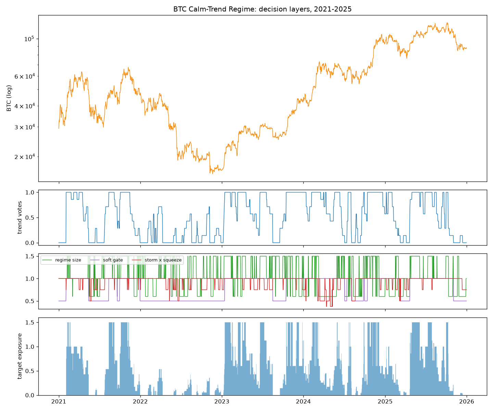
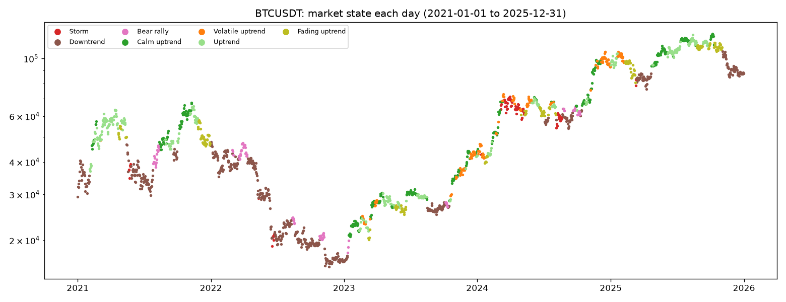
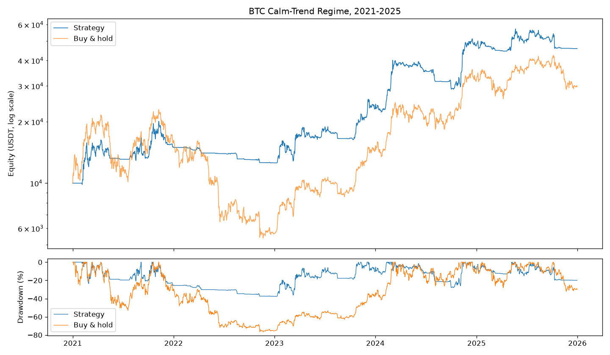

# BTC/USDT Strategy: Calm-Trend Regime (CTR)

**Status: final and frozen.** Selected under evaluation protocol v8 §14 (research ID *F1*) and kept unchanged after the refinement round (v10 §16). Not changed since; every later experiment is in `tries/` and was compared against it.

| | |
|---|---|
| **Market** | BTC/USDT, Binance spot, daily decisions (hourly data for the risk measures) |
| **Style** | Long-only trend following with regime-based position sizing |
| **Capital and costs** | 10,000 USDT; 0.15% fee + slippage on every fill; maximum position 1.5× equity; borrowed USDT charged 8% a year |
| **Code** | `src/strategies/btc_strategy.py` (strategy), `src/strategies/market_state.py` (market-state framework), `src/risk/btc_risk.py` (risk layers as stand-alone functions), `src/strategies/execution.py` (execution settings) |
| **Run** | `.venv/bin/python -m scripts.run_btc_strategy` → `results/btc/` (all metrics, equity, trades, charts) |
| **Behaviour profile** | `.venv/bin/python -m scripts.market_state_report BTCUSDT 2021-01-01 2025-12-31` → `results/btc/market_state_2021_2025/` |
| **Tests** | `tests/test_btc_strategy.py`, `tests/test_market_state.py` (no lookahead, bounded targets, frozen results) |

## Results at a glance

| Period | CTR return | BTC buy-and-hold | CTR Sharpe | B&H Sharpe | CTR max DD | B&H max DD |
|---|---|---|---|---|---|---|
| 2021–2024 (development) | **+373%** | +218% | **1.16** | 0.78 | **−37.5%** | −76.6% |
| 2025 | **−4.1%** | −7.6% | −0.02 | 0.02 | **−19.9%** | −32.0% |
| **2021–2025 (required 5-year backtest)** | **+358%** | +198% | **0.98** | 0.67 | **−37.5%** | −76.6% |
| **2026-01-01 → 10-04 (unseen data, strategy frozen before download)** | **+13.5%** | −2.9% | **0.86** | 0.14 | **−11.2%** | −39.5% |

Over 2021–2025 it beat buy-and-hold in 55% of quarters, and in 8 of the 9 quarters where BTC fell.

---

## 1. Why this strategy: what the data told us

Every rule comes from our own research (`notebooks/01_data_research.ipynb`, `notebooks/02_indicator_analysis.ipynb`, `notebooks/03_ml_research.ipynb`). Four facts about BTC drive the design:

1. **Direction is hard to predict, but the size of moves is not.**
   - No indicator predicted next week's direction consistently (RSI, MACD-style stretch measures, Supertrend, ADX, Heikin-Ashi, Kalman, CUSUM; machine-learning models scored AUC 0.40–0.51).
   - Volatility is forecastable out of sample (R² 0.30–0.73, every year).
2. **Trend-following pays only in calm, orderly trends.** Splitting days by volatility and trend efficiency, a 30-day momentum bet earned money in calm trends in **4 of 4 years** and roughly nothing in high-volatility regimes. Choppiness < 38.2 (a clean trend) also paid in 4 of 4 years.
3. **BTC's sell-off volatility lingers; rally volatility and one-off jumps fade.** Downside semivariance carries about 2× the forecasting weight of upside semivariance. Smooth (bipower) volatility persists while the jump part does not.
4. **The worst damage is in long bear markets.** Buy-and-hold fell −77% in 2022 and stayed under water for about 780 days. Being out of most of a bear market matters more than catching every rally.

So the strategy splits the job in two: **a simple, robust trend signal decides *whether* to be long; the market's regime decides *how much*.**

## 2. The rules

Evaluated at each daily close; orders fill at the **next day's open**.

| Step | Rule | Values |
|---|---|---|
| 1. Direction | Share of 7 trend votes: is the close above its 20, 30, 50, 75, 100, 150 and 200-day average? Each vote has a hysteresis band of 1 × daily volatility, so it doesn't flip on noise. | 0 to 1 |
| 2. Regime | **Calm trend** = volatility percentile ≤ 0.5 *and* 30-day efficiency ratio above its own expanding median, *or* Choppiness(14) < 38.2. **Stormy** = volatility percentile > 0.5. | × 1.5 calm trend, × 0.6 stormy, × 1.0 otherwise |
| 3. Storm brake | Sell-off risk forecast = √(365 · EWMA₃₀(0.5 · bipower variation + downside semivariance)), from hourly data. Brake when it exceeds 1.5 × its 1-year median. | × 0.5 |
| 4. Squeeze | Bollinger Bands (20, 2) inside the Keltner Channel (20, 1.5 ATR) | × 0.75 |
| 5. Long-term gate | Banded 200-day trend state is down | × 0.5 |

**Target exposure** = steps 1 × 2 × 3 × 4, capped at 1.5, then × step 5.

**Execution:**
- An open position is resized only when the target moves by more than 0.25 (this limits churn and costs).
- The strategy waits 5 days before re-entering after an exit.
- No orders are placed on exchange-outage bars.

**Parameters:** all are round or conventional values fixed before testing (the 20–200-day averages, the 0.5 median split, Choppiness 38.2, 1.5× leverage, the 30-day EWMA). None was optimised; neighbouring values were checked instead (§7).

## 3. The market-state framework: how CTR reads any dataset

The rules are organised as a framework that first **names what the market is doing**, then acts (`src/strategies/market_state.py`).
- Every threshold is relative to the dataset's own history: the volatility percentile within the trailing year, the efficiency ratio against its expanding median, the risk forecast against its 1-year median.
- Averages warm up adaptively, using all available bars until the full window exists.
- So the same code works unchanged on new or hidden data from a cold start, and with daily candles only (§7).

| State (priority order) | Definition | 2021–25 share | Average spell | CTR exposure |
|---|---|---|---|---|
| Storm | sell-off risk forecast > 1.5 × its 1-year median | 4% | 7 days | 0.15 |
| Downtrend | 200-day gate down, fewer than half the trend votes | 34% | 31 days | 0.04 |
| Bear rally | 200-day gate down, at least half the votes up | 5% | 9 days | 0.38 |
| **Calm uptrend** | gate up, votes up, calm and orderly | 20% | 7 days | **1.42** |
| Volatile uptrend | gate up, votes up, stormy | 9% | 6 days | 0.54 |
| Uptrend | gate up, votes up, neither | 17% | 7 days | 0.79 |
| Fading uptrend | gate up, fewer than half the votes | 10% | 10 days | 0.27 |

- **States are persistent:** a state stays the same the next day 83–97% of the time.
- **Calm uptrends were followed by the best weeks at the lowest volatility.** This is descriptive (it looks ahead) and is never used by the rules, but it is exactly where CTR is largest.

## 4. Why each component is there, and what was rejected

| Component | Evidence for it | What happens without it |
|---|---|---|
| 7 averaged trend votes | A single lookback is fragile: 30-day momentum gave Sharpe 1.08, but its 20- and 45-day neighbours gave 0.77 and 0.68 (stage 13). The vote share changes little across lookbacks. | Whipsaw trades: 50 trades under 30 days lost 7,900 USDT in the single-lookback baseline |
| Calm-trend leverage 1.5× | Trend payoff is positive in calm trends in 4/4 years. The 18.5% of days at more than 1× earned most of the return. | Long-term votes alone: Sharpe 0.96, +252% (stage 14) |
| Stormy size 0.6× | Momentum payoff ≈ 0 or negative in high-volatility regimes | Entries in stormy markets lost 3,700 USDT net (stage 13 trade analysis) |
| Downside-weighted storm brake | Sell-off volatility persists about 2× more (notebook 02 §3) | A brake on all volatility would also fire in rallies |
| Squeeze warning | Volatility rises about 10–14% after a squeeze, direction random (notebook 02 §4) | Removed in a test, Sharpe fell from 1.13 to 1.04 (stage 10b, B6 vs B7) |
| 200-day soft gate | 2022 bear-market rallies were the main loss of the ungated design (−51% max drawdown, stage 11) | The gate cut 2022's loss from −34% to −16% |

**Tested and rejected, all pre-registered in `docs/evaluation_protocol.md` and recorded in `tries/`:**

| Idea | Result | Stage |
|---|---|---|
| Fixed trailing stop at 3 × ATR | Fired 37 times; Sharpe 1.16 → 0.71, return +373% → +125% | 11 (F2) |
| No leverage after a 15% drawdown | Lower Sharpe (1.05), same max drawdown | 11 (F3) |
| Smoother calm-trend label; downside-only brake | Sharpe +0.01 / +0.02, within noise; failed the cold-start gate | 12 (H1, H3) |
| Leverage on full trend agreement | Worse (Sharpe 1.13, deeper drawdown) | 12 (H2) |
| No leverage when far above the 200-day average, or on volume surges | Dropped *before* testing: those leveraged days earned *more* | 12 |
| Short-term dip trades in an uptrend (rule and ML) | Lost money after costs: −8.2% (rule), −16.5% (ML) vs B&H +102.5%, 2022–24 | 15 |
| ML / RL leverage control (quantile gradient boosting, HMM, contextual bandit) | ML forecasts no better than the simple HAR model; no skill beyond a placebo | 16 |
| ML direction prediction, triple-barrier filter, Q-learning agents | AUC ≤ 0.51; a Q-learning agent lost about 79% | ML research, notebook 03 |
| Previous final K-01 | Sharpe 1.156 (tie), +289%, max DD −33%, exactly 50% of quarters beating B&H | 8 / 11 |

## 5. Risk management plan (BTC-specific)

### 5.1 How position size is controlled
- **At most 1.5× equity, and only in calm trends.** On stormy days at most 0.6×; in a slow downtrend at most 0.3–0.75×.
- **Sell-off volatility cuts size faster than rally volatility** (the downside-weighted storm brake). This is a BTC-specific choice from the semivariance research.
- **The squeeze warning** shrinks size before an expected volatility expansion.
- **The soft gate** halves everything while the 200-day trend is down.

### 5.2 Stop-loss rules
- **The exit is a trend-break stop.** The position is scaled down vote by vote as price falls through the 20–200-day averages, and closed when all votes are down.
- **Measured effect, 2021–2025 (21 trades):**
  - average loss −2.0% of equity;
  - largest loss −10.6% (July 2024 entry, closed in the 5 August 2024 crash);
  - only 1 trade lost more than 6% of equity.
- **Why there is no fixed price stop:** it was tested and destroyed returns (§4). On daily BTC a price stop mostly sells dips that recover, because jumps fade.
- **Gap risk** is modelled: fills happen at the next open, and stops fill through gaps.

### 5.3 Risk–reward (measured on equity)
| | 2021–2024 | 2021–2025 |
|---|---|---|
| Win rate | 27.8% | 28.6% |
| Average win / average loss (% of equity) | +48.4% / −2.2% | +39.6% / −2.0% |
| **Payoff ratio (reward : risk)** | **21.6 : 1** | **19.7 : 1** |
| Profit factor | 6.86 | 6.25 |
| Break-even win rate at this payoff | 4.4% | 4.8% |

This is the classic trend-following profile: many small losses cut quickly, and a few large wins that run for months (the longest lasted 290 days).

### 5.4 Known risks
- **Shocks from calm markets** hit while the strategy holds 1.5×. The worst days were −15.7% (7 Sep 2021) and −10.8% (10 Oct 2025). The worst 7 days: −23.8%. Daily 95% VaR −2.5%, CVaR −4.5%.
- **Slow recovery after a top:** the deepest drawdown (−37.5%, Nov 2021 → Dec 2022) took 723 days to recover.
- **Late entries after long downtrends:** it lags strong bull quarters (2021 Q1 +52% vs +103%; 2026 Q3 +15.7% vs +42.6%).

## 6. Results in detail (2021–2025, the required backtest)

**Required metrics:**

| Metric | Value | | Metric | Value |
|---|---|---|---|---|
| Gross Profit | 42,639.75 USDT | | Buy-and-Hold Return | +197.92% |
| Net Profit | 35,812.22 USDT | | Largest Losing Trade | −3,739.80 USDT |
| Total Closed Trades | 21 | | Largest Winning Trade | 18,768.61 USDT |
| Win Rate | 28.57% | | Sharpe Ratio | 0.98 |
| Max Drawdown | −37.53% | | Sortino Ratio | 1.61 |
| Gross Loss | −6,827.53 USDT | | Average Holding Duration | 65.9 days |
| Average Winning Trade | 7,106.63 USDT | | Maximum Holding Duration | 290 days |
| Average Losing Trade | −455.17 USDT | | | |

Extras: total return +358.1%, annualised +35.6%, Calmar 0.95, exposure 76%, fees 3,834 USDT, financing 932 USDT. Per-period tables, trade history, fills, equity and quarterly files are in `results/btc/<period>/`.

| Year | CTR | BTC | CTR max DD | BTC max DD |
|---|---|---|---|---|
| 2021 | +49.9% | +59.8% | −25.5% | −53.1% |
| 2022 | −16.1% | −64.2% | −16.6% | −66.9% |
| 2023 | +84.4% | +155.6% | −20.5% | −20.0% |
| 2024 | +104.1% | +121.3% | −28.0% | −26.2% |
| 2025 | −3.3% | −6.3% | −19.9% | −32.0% |

**The edge is defence plus leverage in calm trends:**
- it lost 16% in 2022 against −64%;
- it kept most of the bull years;
- it ended about 1.5× buy-and-hold's final equity with half the drawdown.

## 7. Robustness
- **No lookahead:**
  - signals are identical when future data is removed (truncation tests);
  - the backtest matches when cut at any point;
  - a regression test locks the frozen 2021–2024 results (18 trades, +373.15%, Sharpe 1.159).
- **Neighbouring settings** (2021–24) keep at least 96% of the Sharpe: high-vol size 0.5 / 0.7, volatility threshold 0.4 / 0.6, storm brake 1.25 / 1.75, gate floor 0.3 / 0.7, gate lookback 150 / 250.
- **Double costs** (0.30% per fill): Sharpe 1.09 on 2021–24 (B&H 0.78).
- **Cold start** (started with *no history* in each quarter 2021Q2–2023Q4, run to end-2024):
  - mean Sharpe 1.56;
  - max drawdown between −27% and −37%;
  - beat buy-and-hold's Sharpe in 8 of 11 windows (the misses are pure bull-market windows starting at the 2022 bottom).
- **Daily candles only:** with hourly measures approximated from daily OHLC, 2021–24 Sharpe is 1.17 (vs 1.16). The strategy does not need hourly data.
- **New data (2026, run once, protocol §21):**

  | 2026 quarter | CTR | BTC |
  |---|---|---|
  | Q1 | −3.2% | −22.1% |
  | Q2 | −1.6% | −14.2% |
  | Q3 | +15.7% | +42.6% |

  Year to 4 Oct: +13.5% vs −2.9%, max DD −11.2% vs −39.5%. Same pattern as every earlier year: small losses in falls, partial upside in rallies. Results in `tries/results/stage17_test_2026/`.

## 8. Why we trust it, and its limits
- **Many trials:** about 1,000 BTC backtests have been logged in this project, so some out-performance could be luck. The main defences are consistency (every year positive or better than BTC), stable neighbours, the cold-start runs and the 2026 result on genuinely new data.
- **One-sample caveat:** the 2026 result is one 9-month sample with 4 trades.
- **Design limits:** it is long-only (no gain from falls), it lags early rallies, and calm-market crashes hit at 1.5×.

## 9. How it was developed (honest history)
1. **Stages 1–9:** baselines, trend ensembles, regime gate, chop filter, leading to K-01, frozen in protocol v6.
   - 2024 failed as a validation year for the earlier designs and was then treated as training data (v4).
   - 2025 was used once, as K-01's test (−17.5% vs −7.6%).
2. **Indicator research (notebook 02, 25+ indicators):** risk and regime indicators are reliable; direction indicators are not.
3. **Stages 10–10b:** first regime-sizing designs (B7: Sharpe 1.13, +375%, but max DD −51%).
   - 2025 had been used to test earlier candidate strategies before CTR was selected; the unseen-data test of CTR is 2026 (§7).
4. **Stage 11:** the 2022 bear rallies were diagnosed as B7's weakness, and K-01's soft gate was added. That design is **CTR (F1)**.
   - It tied K-01 on Sharpe (1.1588 vs 1.1556); the protocol gate had quoted a rounded 1.16.
   - The team chose CTR (protocol v8a) for +373% vs +289% and 56% vs 50% of quarters beating buy-and-hold, and accepted a deeper drawdown.
5. **Stage 12:** the market-state framework; refinements H1–H4 did not pass the cold-start gate, so CTR was unchanged.
6. **Stages 13–17:** reliable-indicator baseline, long-term direction study, short-term layer, ML risk engine. None beat CTR. Then the one-time 2026 test.

All of it is documented in `docs/evaluation_protocol.md` (every rule written before its run), `docs/project_history.md`, and `tries/README.md`.
