# BTC/USDT Strategy: Calm-Trend Regime with calm-bear shorts (CTR-S), full technical document

Part I describes the strategy, its risk plan and results. **Part II gives the mathematical foundations:** the statistical properties of BTC returns, why each family of directional indicators fails, why the volatility-based components work, and the multiple-testing correction. A short version is `reports/btc_strategy_summary.md`.

# Part I: The strategy

**Status: final and frozen.** CTR-S = the Calm-Trend Regime (CTR, research ID *F1*, protocol v8 §14 / v10 §16) plus a disciplined short side (research ID *X3*, protocol v28 §34). It was adopted as the BTC final in protocol v29 §35. The long side is exactly the previous final, CTR. The short side only acts on days when CTR holds nothing.

| | |
|---|---|
| **Market** | BTC/USDT, Binance spot, daily decisions (hourly data for the risk measures) |
| **Style** | Trend following with regime-based position sizing: long in uptrends; short at half size only in calm, fully confirmed bear markets |
| **Capital and costs** | 10,000 USDT; 0.15% fee + slippage on every fill; maximum position 1.5× equity long and 0.5× short; borrowed USDT charged 8% a year; borrowed BTC (for shorts) charged an assumed 10% a year, daily |
| **Code** | `src/strategies/btc_strategy.py` (strategy and short side), `src/strategies/market_state.py` (market-state framework), `src/risk/btc_risk.py` (risk layers as stand-alone functions), `src/strategies/execution.py` (execution settings, `btc_trading_config`) |
| **Run** | `.venv/bin/python -m scripts.run_btc_strategy` → `results/btc/` (all metrics, equity, trades, charts, comparison with the long-only CTR) |
| **Behaviour profile** | `.venv/bin/python -m scripts.market_state_report BTCUSDT 2021-01-01 2025-12-31` → `results/btc/market_state_2021_2025/` |
| **Tests** | `tests/test_btc_strategy.py`, `tests/test_market_state.py`, `tests/test_engine.py` (no lookahead, bounded targets, short only when CTR is flat, short-borrow fee, frozen results) |

## Results at a glance

| Period | CTR-S return | BTC buy-and-hold | CTR-S Sharpe | B&H Sharpe | CTR-S max DD | B&H max DD |
|---|---|---|---|---|---|---|
| 2021–2024 (development) | **+389%** | +218% | **1.16** | 0.78 | **−29.6%** | −76.6% |
| 2025 | **−5.1%** | −7.6% | −0.05 | 0.02 | **−20.6%** | −32.0% |
| **2021–2025 (required 5-year backtest)** | **+368%** | +198% | **0.98** | 0.67 | **−29.6%** | −76.6% |
| 2026-01-01 → 10-04 | **+20.9%** | −2.9% | **1.21** | 0.14 | **−11.2%** | −39.5% |
| 2018-01-01 → 2026-10-04 (longer history) | **+4,263%** | +545% | **1.30** | 0.66 | **−35.4%** | −81.2% |

- Over 2021–2025 it beat buy-and-hold in 55% of quarters, and in 8 of the 9 quarters where BTC fell.
- **Against the long-only CTR (2021–2025):**
  - return +368% vs +358%, with the same Sharpe (0.98);
  - max drawdown **−29.6% vs −37.5%**;
  - longest time under water **496 vs 723 days**;
  - Calmar ratio (annual return ÷ max drawdown) 1.22 vs 0.95.

---

## 1. Why this strategy: what the data told us

Every rule comes from our own research (`notebooks/01_data_research.ipynb`, `notebooks/02_indicator_analysis.ipynb`, `notebooks/03_ml_research.ipynb`). Five facts about BTC drive the design:

1. **Direction is hard to predict, but the size of moves is not.**
   - No indicator predicted next week's direction consistently (RSI, MACD-style stretch measures, Supertrend, ADX, Heikin-Ashi, Kalman, CUSUM; machine-learning models scored AUC 0.40–0.51).
   - Volatility is forecastable out of sample (R² 0.30–0.73, every year).
2. **Trend-following pays only in calm, orderly trends.** We split days by volatility and trend efficiency. A 30-day momentum bet earned money in calm trends in **4 of 4 years** and roughly nothing in high-volatility regimes. Choppiness < 38.2 (a clean trend) also paid in 4 of 4 years.
3. **BTC's sell-off volatility lingers; rally volatility and one-off jumps fade.**
   - Downside semivariance carries about 2× the forecasting weight of upside semivariance.
   - Smooth (bipower) volatility persists, while the jump part does not.
4. **The worst damage is in long bear markets.** Buy-and-hold fell −77% in 2022 and stayed under water for about 780 days. Being out of most of a bear market matters more than catching every rally.
5. **Calm declines keep going; violent ones snap back.**
   - The same calm/stormy split holds on the way down: an orderly bear market (every trend horizon down, volatility in the calmer half of its year) tends to keep grinding lower.
   - Panics and capitulations (BTC far below its yearly high) produce the sharpest rebounds. The literature calls this the asymmetric mean reversion of BTC's negative extremes, and our RSI < 35 bounces confirm it (`tries/reports/research_short_term_strategies.md`).
   - Shorting is only worth its costs and risks in the first case.

So the strategy splits the job in two:
- **a simple, robust trend signal decides *whether* to be long, flat or short;**
- **the market's regime decides *how much*, and whether a short is allowed at all.**

## 2. The rules

Evaluated at each daily close; orders fill at the **next day's open**.

**Long side (CTR, unchanged):**

| Step | Rule | Values |
|---|---|---|
| 1. Direction | Share of 7 trend votes: is the close above its 20, 30, 50, 75, 100, 150 and 200-day average? Each vote has a hysteresis band of 1 × daily volatility, so it doesn't flip on noise. | 0 to 1 |
| 2. Regime | **Calm trend** = volatility percentile ≤ 0.5 *and* 30-day efficiency ratio above its own expanding median, *or* Choppiness(14) < 38.2. **Stormy** = volatility percentile > 0.5. | × 1.5 calm trend, × 0.6 stormy, × 1.0 otherwise |
| 3. Storm brake | Sell-off risk forecast = √(365 · EWMA₃₀(0.5 · bipower variation + downside semivariance)), from hourly data. Brake when it exceeds 1.5 × its 1-year median. | × 0.5 |
| 4. Squeeze | Bollinger Bands (20, 2) inside the Keltner Channel (20, 1.5 ATR) | × 0.75 |
| 5. Long-term gate | Banded 200-day trend state is down | × 0.5 |

**Long target** = steps 1 × 2 × 3 × 4, capped at 1.5, then × step 5.

**Short side (new):** hold **−0.5× equity** only while **all five** conditions hold, and cover at the next open as soon as any one fails.

| Condition | Rule | Why |
|---|---|---|
| a. CTR is flat | Long target = 0 | The short never overrides or reduces a long |
| b. Slow trend down | 200-day gate is down | A bear market, not a dip in a bull market |
| c. Every horizon agrees | All 7 trend votes are down | Full confirmation; a single vote turning up (usually the 20-day) covers the short |
| d. Calm decline | Volatility percentile ≤ 0.5 (the same calm/stormy split as step 2) | Orderly declines persist; violent markets squeeze shorts |
| e. No capitulation | BTC is less than 60% below its 365-day high | After a crash, rebounds are sharpest; that is no place to be short |

**Execution:**
- An open position is resized only when the target moves by more than 0.25 (this limits churn and costs).
- The strategy waits 5 days before re-entering after an exit.
- No orders are placed on exchange-outage bars.
- Shorts pay the assumed 10%/yr borrow fee on the short position's value, every day, inside the backtest.

**Parameters:**
- All are round or conventional values fixed before testing: the 20–200-day averages, the 0.5 median split, Choppiness 38.2, 1.5× leverage, the 30-day EWMA, half-size shorts, and the −60% capitulation line.
- None was optimised; neighbouring values were checked instead (§7).
- The short side reuses the long side's own state variables (gate, votes, volatility percentile). Only two new numbers were added: the size and the capitulation line.

## 3. The market-state framework: how CTR-S reads any dataset

The rules are organised as a framework that first **names what the market is doing**, then acts (`src/strategies/market_state.py`).
- Every threshold is relative to the dataset's own history: the volatility percentile within the trailing year, the efficiency ratio against its expanding median, the risk forecast against its 1-year median.
- Averages warm up adaptively, using all available bars until the full window exists.
- So the same code works unchanged on new or hidden data from a cold start, and with daily candles only (§7).

| State (priority order) | Definition | 2021–25 share | Average spell | Long exposure (CTR) |
|---|---|---|---|---|
| Storm | sell-off risk forecast > 1.5 × its 1-year median | 4% | 7 days | 0.15 |
| Downtrend | 200-day gate down, fewer than half the trend votes | 34% | 31 days | 0.04 |
| Bear rally | 200-day gate down, at least half the votes up | 5% | 9 days | 0.38 |
| **Calm uptrend** | gate up, votes up, calm and orderly | 20% | 7 days | **1.42** |
| Volatile uptrend | gate up, votes up, stormy | 9% | 6 days | 0.54 |
| Uptrend | gate up, votes up, neither | 17% | 7 days | 0.79 |
| Fading uptrend | gate up, fewer than half the votes | 10% | 10 days | 0.27 |

- **States are persistent:** a state stays the same the next day 83–97% of the time.
- **Calm uptrends were followed by the best weeks at the lowest volatility.** This is descriptive (it looks ahead) and is never used by the rules, but it is exactly where the strategy is largest.
- **The short side lives inside the Downtrend state:** it is its calm, fully confirmed, non-capitulation part. That was about 6% of 2021–25 days.

## 4. Why each component is there, and what was rejected

| Component | Evidence for it | What happens without it |
|---|---|---|
| 7 averaged trend votes | A single lookback is fragile: 30-day momentum gave Sharpe 1.08, but its 20- and 45-day neighbours gave 0.77 and 0.68 (stage 13). The vote share changes little across lookbacks. | Whipsaw trades: 50 trades under 30 days lost 7,900 USDT in the single-lookback baseline |
| Calm-trend leverage 1.5× | Trend payoff is positive in calm trends in 4/4 years. The 18.5% of days at more than 1× earned most of the return. | Long-term votes alone: Sharpe 0.96, +252% (stage 14) |
| Stormy size 0.6× | Momentum payoff ≈ 0 or negative in high-volatility regimes | Entries in stormy markets lost 3,700 USDT net (stage 13 trade analysis) |
| Downside-weighted storm brake | Sell-off volatility persists about 2× more (notebook 02 §3) | A brake on all volatility would also fire in rallies |
| Squeeze warning | Volatility rises about 10–14% after a squeeze, direction random (notebook 02 §4) | Removed in a test, Sharpe fell from 1.13 to 1.04 (stage 10b, B6 vs B7) |
| 200-day soft gate | 2022 bear-market rallies were the main loss of the ungated design (−51% max drawdown, stage 11) | The gate cut 2022's loss from −34% to −16% |
| Short side, calm filter (d) | Same calm/stormy logic as the long side | Shorting every confirmed bear (X4): Sharpe 1.16 → 0.95, max DD −40% (stage 32) |
| Short side, capitulation filter (e) | Sharpest rebounds come after the deepest falls | Without it (X1): Sharpe 1.10, +343%; 2022 −7.4% instead of −0.3% (stage 32) |
| Short size 0.5× | Shorts are a bet against a positive long-run drift; half size limits squeeze risk | Full size (X2): Sharpe 0.98, +284%, max DD −36.7% (stage 32) |

**Tested and rejected, all pre-registered in `docs/evaluation_protocol.md` and recorded in `tries/`:**

| Idea | Result | Stage |
|---|---|---|
| Fixed trailing stop at 3 × ATR | Fired 37 times; Sharpe 1.16 → 0.71, return +373% → +125% | 11 (F2) |
| No leverage after a 15% drawdown | Lower Sharpe (1.05), same max drawdown | 11 (F3) |
| Smoother calm-trend label; downside-only brake | Sharpe +0.01 / +0.02, within noise; failed the cold-start gate | 12 (H1, H3) |
| Leverage on full trend agreement | Worse (Sharpe 1.13, deeper drawdown) | 12 (H2) |
| No leverage when far above the 200-day average, or on volume surges | Dropped *before* testing: those leveraged days earned *more* | 12 |
| Short-term dip trades in an uptrend (rule and ML) | Lost money after costs: −8.2% (rule), −16.5% (ML) vs B&H +102.5%, 2022–24 | 15 |
| ML / RL leverage control (quantile gradient boosting, HMM, contextual bandit) | ML forecasts no better than the simple HAR model; no skill beyond a placebo | 16 |
| ML direction prediction, triple-barrier filter, Q-learning agents | AUC ≤ 0.51; a Q-learning agent lost about 79% | ML research, notebook 03 |
| Short-term and swing mean-reversion sleeves next to the trend | Edge per trade below the 0.30% round-trip cost | 25, 26 |
| Bayesian regime-Kelly sizing | No gain over the fixed regime sizes | 27 |
| 1.5× above a banded 100-day average, else flat | Beat buy-and-hold in 8 of 9 years 2018–2026, but max drawdown −79.5% (−77% in 2018) | 31, 33 |
| Same short side on ETH | No variant beat ETH's long-only CTR (ETH stays long-only) | 32 |
| Previous final K-01 | Sharpe 1.156 (tie), +289%, max DD −33%, exactly 50% of quarters beating B&H | 8 / 11 |

## 5. Risk management plan (BTC-specific)

### 5.1 How position size is controlled
- **Long: at most 1.5× equity, and only in calm trends.** On stormy days at most 0.6×; in a slow downtrend at most 0.3–0.75×.
- **Short: at most 0.5× equity, and only in calm, fully confirmed, non-capitulation bear markets.** That is one third of the long side's maximum. A short is a bet against BTC's long-run drift, and its loss is not capped at 100%.
- **Sell-off volatility cuts size faster than rally volatility** (the downside-weighted storm brake). This is a BTC-specific choice from the semivariance research.
- **The squeeze warning** shrinks size before an expected volatility expansion.
- **The soft gate** halves every long while the 200-day trend is down.
- **Never long and short at once:** the short only exists when the long target is exactly zero (tested).

### 5.2 Stop-loss rules
- **Long exit: a trend-break stop.** The position is scaled down vote by vote as price falls through the 20–200-day averages, and closed when all votes are down.
- **Short exit: a trend-break stop on the other side.** The short is covered at the next open as soon as *any* condition fails. This is usually the 20-day vote turning up, i.e. price closing above its banded 20-day average. A volatility jump or a slide past −60% (capitulation) also covers it.
- **Measured effect, 2021–2025 (36 trades: 21 long, 15 short):**
  - average loss −2.0% of equity on longs and −2.5% on shorts;
  - largest loss −10.6% (a long: July 2024 entry, closed in the 5 August 2024 crash);
  - largest short loss −5.9% (June 2021);
  - only 1 trade lost more than 6% of equity;
  - shorts last 7.7 days on average.
- **Why there is no fixed price stop:** it was tested and destroyed returns (§4). On daily BTC a price stop mostly sells dips that recover, because jumps fade.
- **Gap risk** is modelled: fills happen at the next open, and stops fill through gaps.

### 5.3 Risk–reward (measured on equity)
| | 2021–2024 | 2021–2025 |
|---|---|---|
| Win rate | 35.5% | 33.3% |
| Average win / average loss (% of equity) | +24.4% / −2.5% | +22.0% / −2.2% |
| **Payoff ratio (reward : risk)** | **9.6 : 1** | **10.0 : 1** |
| Profit factor | 4.82 | 4.31 |
| Break-even win rate at this payoff | 9.4% | 9.1% |

- **Profile:** this is classic trend following. Many small losses are cut quickly, and a few large wins run for months (the longest lasted 290 days).
- **Why the payoff ratio is lower than the long-only CTR's (19.7 : 1):** the short trades are short and small, with an average win of +4.4% of equity, so they pull the average win down.
- **What the shorts contribute:**
  - they sum to +3.8% of equity over 2021–25: +2.4k USDT in 2022 against −2.7k in the other years;
  - in USDT they net −334, because the 2022 gains came at low equity and the bull-year losses at high equity;
  - their real value is the path: they turn 2022 from −16% into −1%, so the 2023–24 bull market compounds from a higher base.

### 5.4 Known risks
- **Shocks from calm markets** hit while the strategy holds 1.5×. The worst days were −15.7% (7 Sep 2021) and −10.8% (10 Oct 2025). The worst 7 days: −23.8%. Daily 95% VaR −2.6%, CVaR −4.6%.
- **Short squeezes in bull-market dips:** a calm, confirmed decline inside a bull market can reverse fast. Examples are June 2021 (−5.9% of equity), September 2023 (−2.0%) and September 2024 (−2.2%). The June 2021 shorts cost 2021 about 13 points against the long-only CTR.
- **Deepest drawdown:** −29.6%, from March 2024 to October 2024, recovered in November 2024. The longest time under water was 496 days, from November 2021.
- **Late entries after long downtrends:** it lags strong bull quarters (2021 Q1 +52% vs +103%; 2026 Q3 +15.7% vs +42.6%).
- **Borrow cost:** the 10%/yr fee for borrowing BTC is an assumption (exchange margin rates vary). Shorts were held about 6% of days, so the fee cost 235 USDT over 2021–25.

## 6. Results in detail (2021–2025, the required backtest)

**Required metrics:**

| Metric | Value | | Metric | Value |
|---|---|---|---|---|
| Gross Profit | 47,963.39 USDT | | Buy-and-Hold Return | +197.92% |
| Net Profit | 36,839.51 USDT | | Largest Losing Trade | −3,950.76 USDT |
| Total Closed Trades | 36 (21 long, 15 short) | | Largest Winning Trade | 19,827.38 USDT |
| Win Rate | 33.33% | | Sharpe Ratio | 0.98 |
| Max Drawdown | −29.56% | | Sortino Ratio | 1.60 |
| Gross Loss | −11,123.88 USDT | | Average Holding Duration | 41.6 days |
| Average Winning Trade | 3,996.95 USDT | | Maximum Holding Duration | 290 days |
| Average Losing Trade | −463.49 USDT | | | |

- **Extras:** total return +368.4%, annualised +36.2%, Calmar 1.22, exposure 82%, fees 4,412 USDT, financing (USDT and BTC borrowing) 1,194 USDT.
- **Where the files are:** per-period tables, trade history, fills, equity and quarterly files are in `results/btc/<period>/`.

| Year | CTR-S | Long-only CTR | BTC | CTR-S max DD | CTR max DD | BTC max DD |
|---|---|---|---|---|---|---|
| 2021 | +37.1% | +49.9% | +59.8% | −27.5% | −25.5% | −53.1% |
| 2022 | **−1.1%** | −16.1% | −64.2% | −12.7% | −16.6% | −66.9% |
| 2023 | +80.8% | +84.4% | +155.6% | −20.5% | −20.5% | −20.0% |
| 2024 | +99.6% | +104.1% | +121.3% | −29.6% | −28.0% | −26.2% |
| 2025 | −4.3% | −3.3% | −6.3% | −20.6% | −19.9% | −32.0% |

**The edge is defence, leverage in calm trends, and a small short in calm bear markets:**
- it was flat in 2022 (−1%) against −64%;
- it kept most of the bull years;
- it ended with about 1.6× buy-and-hold's final equity and well under half its drawdown.

## 7. Robustness
- **No lookahead:**
  - signals are identical when future data is removed (truncation tests);
  - the backtest, shorts included, matches when cut at any point;
  - a regression test locks the frozen 2021–2024 results (31 trades, 13 of them short, +388.85%, Sharpe 1.163, max DD −29.56%).
- **Neighbouring settings** (2021–24):
  - Long side: keeps at least 96% of the Sharpe at high-vol size 0.5 / 0.7, volatility threshold 0.4 / 0.6, storm brake 1.25 / 1.75, gate floor 0.3 / 0.7 and gate lookback 150 / 250.
  - Short side: the worst neighbour (short size 0.25 / 0.75, calm threshold 0.4 / 0.6) keeps 98% of the Sharpe (1.14 vs 1.16).
- **Double costs** (0.30% per fill): Sharpe 1.08 on 2021–24 (B&H 0.78).
- **Cold start** (started with *no history* in each quarter 2021Q2–2023Q4, run to end-2024):
  - mean Sharpe 1.49 (long-only CTR: 1.56);
  - max drawdown between −28% and −38%;
  - beat buy-and-hold's Sharpe in 7 of 11 windows (CTR: 8). The misses are bull-market windows starting near the 2022 bottom.
- **Daily candles only:** with hourly measures approximated from daily OHLC, 2021–24 Sharpe is 1.17 (vs 1.16). The strategy does not need hourly data.
- **Longer history (2018 → Oct 2026, warm-up from August 2017):**

  | Year | CTR-S | Long-only CTR | BTC | CTR-S max DD | Shorts |
  |---|---|---|---|---|---|
  | 2018 | **−22.6%** | −30.2% | −72.4% | −29.8% | 4 |
  | 2019 | **+179.1%** | +175.5% | +89.0% | −30.7% | 3 |
  | 2020 | +285.3% | +242.4% | +300.5% | −22.8% | 2 |
  | 2026 (to 4 Oct) | **+20.9%** | +13.5% | −2.9% | −11.2% | 4 |
  | **2018 – Oct 2026** | **+4,263%** | +2,886% | +545% | −35.4% | 23 |

  - **2026 by quarter:**

    | Quarter | CTR-S | BTC |
    |---|---|---|
    | Q1 | −2.2% | −22.1% |
    | Q2 | +3.8% | −14.1% |
    | Q3 | +15.7% | +42.6% |
    | Q4 to date | +3.0% | +3.5% |

  - **Sharpe 1.30 over the whole period** (CTR 1.21, buy-and-hold 0.66).
  - **Charts:** `tries/results/stage33_x3_by_year/`.
  - **Not fully out-of-sample:** no parameter was set on these years, but the stage-32 selection checked rolling 1-year windows over 2017–2026 (§9).

## 8. Why we trust it, and its limits
- **Many trials:** about 1,000 BTC backtests have been logged in this project, so some out-performance could be luck.
  - The main defences are consistency: every year is positive or better than BTC, and CTR-S beat the long-only CTR in 2018, 2019, 2020, 2022 and 2026.
  - Stable neighbours, the cold-start runs and the 2018–2020 history add to that.
- **One-sample caveat:** the short side traded 23 times in nearly nine years. Its gain rests mainly on two bear markets (2018 and 2022).
- **Design limits:**
  - it lags early rallies, and calm-market crashes hit at 1.5×;
  - the shorts give back a few points in most bull years (2021 −13, 2023 −4, 2024 −5 points vs CTR);
  - the short-borrow cost is an assumption.

## 9. How it was developed (honest history)
1. **Stages 1–9:** baselines, trend ensembles, regime gate, chop filter, leading to K-01, frozen in protocol v6.
   - 2024 failed as a validation year for the earlier designs and was then treated as training data (v4).
   - 2025 was used once, as K-01's test (−17.5% vs −7.6%).
2. **Indicator research (notebook 02, 25+ indicators):** risk and regime indicators are reliable; direction indicators are not.
3. **Stages 10–10b:** first regime-sizing designs (B7: Sharpe 1.13, +375%, but max DD −51%).
4. **Stage 11:** the 2022 bear rallies were diagnosed as B7's weakness, and K-01's soft gate was added. That design is **CTR (F1)**.
   - It tied K-01 on Sharpe (1.1588 vs 1.1556); the protocol gate had quoted a rounded 1.16.
   - The team chose CTR (protocol v8a) for +373% vs +289% and 56% vs 50% of quarters beating buy-and-hold, and accepted a deeper drawdown.
5. **Stage 12:** the market-state framework; refinements H1–H4 did not pass the cold-start gate, so CTR was unchanged.
6. **Stages 13–27:** reliable-indicator baseline, long-term direction study, short-term layer, ML risk engine, data back to 2018, short-term and swing sleeves, Bayesian regime-Kelly. None beat CTR.
7. **Stages 28–31:** full 2017–2026 history and the rolling 1-year window objective (protocol §33).
   - CTR beat buy-and-hold in about 94% of bear windows but only about 20% of bull windows.
8. **Stage 32 (protocol §34):** four pre-registered short sides X1–X4 on top of CTR.
   - **Gates:** on 2021–24, beat CTR's Sharpe and return (also at 2× costs) and keep 80% of the Sharpe at every neighbour. On the 2017–2026 window test, beat as many windows as CTR and have more positive bear windows.
   - **Result:** only X3 passed all gates. On ETH, no variant passed.
9. **Stage 33 and protocol v29 §35:** X3 was checked year by year from 2018 to 2026 and adopted as the BTC final under the name **CTR-S**.
   - **The fee moved into the engine:** the short-borrow fee, applied after the fact in stage 32, is now charged inside the backtest engine (`short_borrow_rate`). The 2021–24 result is unchanged at the reported precision (+388.85% vs +388.66%).
   - **Archive:** the previous final's results and documents are kept in `tries/results/btc_ctr_v1/` and `tries/reports/btc_strategy_ctr_v1.md`.

All of it is documented in `docs/evaluation_protocol.md` (every rule written before its run), `docs/project_history.md`, and `tries/README.md`.

---

# Part II: Mathematical foundations

Every number below was measured on our data (2021–2024 unless stated), in `notebooks/01–03`, `reports/indicator_analysis_report.md` and the experiment reports. The derivations are standard results; references are listed at the end.

## M1. Notation, information sets and causality

- Let Pt be the BTC close of day t and rt = ln Pt − ln Pt−1 the log return.
- Let ℱt = σ(Ps, Hs, Ls, Vs, … : s ≤ t) be the **filtration** generated by everything observable up to the close of day t.
- A strategy is a position process wt that must be **ℱt-adapted** (measurable with respect to ℱt). It is executed at the next open, so the portfolio return is

<picture><source media="(prefers-color-scheme: dark)" srcset="figures/math/eq01-dark.svg"></picture>

where b is the daily borrowing rate on leverage above 1. Adaptedness is exactly the "no lookahead" property. The truncation test checks it empirically: for any cut-off T, the signal computed on ℱT alone must equal the signal computed on the full sample up to T.

## M2. The statistical nature of BTC returns

Write the return as a location–scale process

<picture><source media="(prefers-color-scheme: dark)" srcset="figures/math/eq02-dark.svg"></picture>

Three stylised facts, all measured on our data, determine what can and cannot be traded.

**(a) Heavy tails.**
- Hourly excess kurtosis is 15.7 (BTC).
- The Hill estimator of the tail index, α̂ = ((1/k)Σi=1kln X(i) − ln X(k))−1, gives α̂ ≈ 2.7–3.7 for hourly returns, and a fitted Student-t for daily returns has ν ≈ 2.5 degrees of freedom.
- Since 𝔼|r|p < ∞ only for p < α, the **fourth moment is not finite**, so any statistic built on kurtosis or on squared errors of extreme moves is unstable.

**(b) Volatility clustering with long memory.**
- The autocorrelation of ln RVt is 0.63 at lag 1 and still 0.26 at lag 90.
- σt is therefore highly predictable.

**(c) Approximate martingale-difference behaviour of the mean.** The **variance ratio**

<picture><source media="(prefers-color-scheme: dark)" srcset="figures/math/eq03-dark.svg">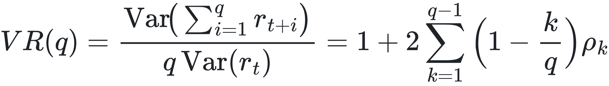</picture>

is a weighted sum of autocorrelations ρk. With the heteroskedasticity-robust Lo–MacKinlay statistic, our daily estimates are VR(2)=0.97, VR(5)=1.00, VR(10)=1.01 and VR(20)=1.02, all with |z|<1.

Hence ρk ≈ 0, and to first order

<picture><source media="(prefers-color-scheme: dark)" srcset="figures/math/eq04-dark.svg"></picture>

**The central consequence.** The conditional **second** moment is predictable; the conditional **first** moment is (almost) not. Every successful component of CTR uses σt; every failed indicator tried to predict μt.

## M3. Why directional indicators fail

### M3.1 The information coefficient and the cost hurdle
- Let st be any ℱt-measurable signal and IC = corr(st, rt+1:t+h) its information coefficient.
- If (s, r) is approximately jointly Gaussian with 𝔼[r]=0, the expected return of the sign bet wt = sign(st) is

<picture><source media="(prefers-color-scheme: dark)" srcset="figures/math/eq05-dark.svg">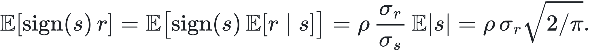</picture>

**Our strongest short-horizon effect** (the 4-hour return predicting the next 4 hours) has ρ ≈ −0.07 (t=−11, same sign in every year).
- With σ4h = 0.665/√(2190) ≈ 1.42%, the gross edge per bet is about **7.9 bps**, against **30 bps** of round-trip costs. The measured extreme-decile spread (13–15 bps) confirms the order of magnitude.
- The effect is real in the statistical sense and unprofitable in the economic sense.

The **fundamental law of active management** gives the same verdict at portfolio level: IR ≈ IC√BR.
- For a weekly signal, the breadth is BR ≈ 52 independent bets a year.
- |IC| ≤ 0.05 then gives IR ≤ 0.36 *before* costs, and turnover costs remove most of it.

### M3.2 Non-stationarity: an IC that changes sign
Treat each year's IC as a draw ICy = κ̄ + uy with uy ~ (0, τ2).
- For RSI, stochastic RSI, %B, z-score, ADX, DI spread, Supertrend, EMA ribbon, Aroon, Heikin-Ashi, Kalman slope and CUSUM, the yearly ICs change sign between years (e.g. Supertrend +0.11, −0.11, −0.04, −0.12).
- So τ ≫ |κ̄|: the random-effect variance dominates the mean, and a signal fitted in one regime is a coin flip in the next.
- The same instability shows up in the weekly variance ratio by year: VR(168h) = 0.83 (2021, mean-reverting), 1.05 (2022), 1.34 (2023, trending). No fixed directional rule can be right in all three.

### M3.3 Oscillators: RSI, stochastic RSI, Bollinger %B, z-scores
- RSI is a bounded monotone transform of a ratio of Wilder averages:

<picture><source media="(prefers-color-scheme: dark)" srcset="figures/math/eq06-dark.svg">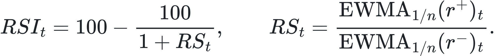</picture>

- It is ℱt-measurable. Under the martingale-difference property, 𝔼[rt+1 | RSIt] = 𝔼[𝔼[rt+1 | ℱt] | RSIt] ≈ μ, independent of the RSI level.
- "Overbought/oversold" trading presumes **negative serial dependence**, ρk < 0, at the oscillator's horizon. With VR ≈ 1 there is none on average.
- In trending regimes (VR > 1) the sign even reverses, which is exactly what we measured: RSI > 70 was followed by *gains* in the 2023–24 bull years and losses in 2022.

### M3.4 ADX: a sign-invariant statistic
DXt = 100(|DI+t − DI−t|)/(DI+t + DI−t), and ADX is its Wilder average.
- **No direction by construction.** Under the reflection of the price path (up-moves ↔ down-moves), DI+ ↔ DI− and DX is unchanged. ADX is an **even function of direction**, so it cannot carry directional information.
- **Built-in lag.** Wilder smoothing is an EWMA with α = 1/14, whose mean lag is (1−α)/α = 13 bars. ADX applies it twice (to the DIs, then to DX), so its effective delay is about 26 bars. It reports trend magnitude **after** the move, which matches its positive link with *past* volatility and zero link with future trend profit.

### M3.5 Moving-average crossovers, Supertrend, EMA ribbon: linear filters with delay
An n-day SMA is a finite impulse response filter with symmetric weights. Its **group delay** is

<picture><source media="(prefers-color-scheme: dark)" srcset="figures/math/eq07-dark.svg">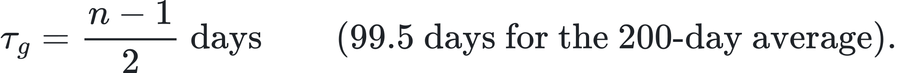</picture>

To leading order, a linear trend rule holds wt = Σk≥0 ak rt−k, so its expected P&L is a **weighted sum of autocovariances**:

<picture><source media="(prefers-color-scheme: dark)" srcset="figures/math/eq08-dark.svg">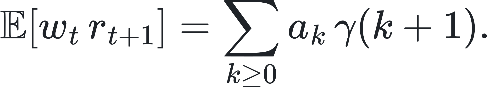</picture>

This is the standard decomposition of trend-following returns.
- With γ(k) ≈ 0 the expected P&L is about zero, while every sign change of w costs 2c.
- Fast filters change sign more often: the single 30-day rule made 59 trades in 2021–24, while the 100–250-day vote share made 9.
- That is why the fast rule lost 7,900 USDT on trades shorter than 30 days, and why slow filters only pay through **rare, persistent** autocorrelation episodes (the multi-month 2023–24 trends).

### M3.6 Heikin-Ashi candles: an exponential filter in disguise
- With HAct = (Ot+Ht+Lt+Ct)/4 and HAot = ½(HAot−1+HAct−1), unrolling the recursion gives

<picture><source media="(prefers-color-scheme: dark)" srcset="figures/math/eq09-dark.svg">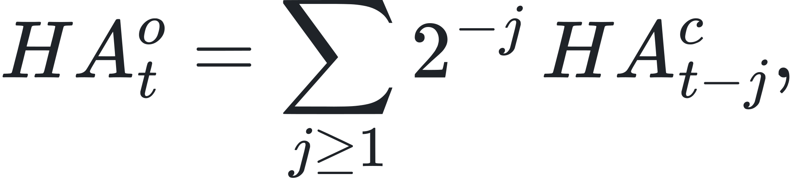</picture>

an EWMA with α = 1/2 of the *lagged* typical price.
- The candle colour sign(HAct − HAot) is therefore the sign of a very short momentum filter, so it inherits M3.5's zero expected P&L. It is causal (allowed) but uninformative.

### M3.7 The Kalman filter: an EWMA by another name
For the local-level model xt = ℓt + εt (Var=R), ℓt = ℓt−1 + ηt (Var=Q):
- The prior variance converges to the solution of the **algebraic Riccati equation**

<picture><source media="(prefers-color-scheme: dark)" srcset="figures/math/eq10-dark.svg">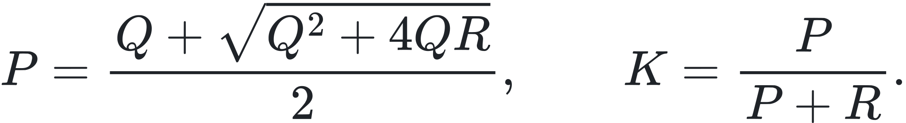</picture>

- The filtered level is then ℓ̂t = ℓ̂t−1 + K(xt − ℓ̂t−1), an EWMA with α = K.
- For our Q/R = 0.01: K = 0.0951, an EWMA span of 2/K − 1 ≈ 20 days.
- The "optimal state estimate" is a 20-day exponential moving average, and its slope carries no more directional information than any other trend filter.

### M3.8 CUSUM change detection: optimality assumptions violated
Page's CUSUM, S+t = max(0, S+t−1 + dt − k), is optimal (Lorden; Moustakides) for detecting a shift between **known** densities of **i.i.d.** observations. Both conditions fail here:
- **Not i.i.d.:** dt = ln Pt − ℓ̂t is an EWMA residual, autocorrelated with coefficient about 1−K ≈ 0.9.
- **No meaningful shift to detect:** the mean shift is negligible relative to σ (M2c).

The average run lengths therefore have no guaranteed meaning, and the bull/bear labels flip sign in predictive value year to year (ICs +0.14, −0.11, +0.03, −0.08).

### M3.9 The Hurst exponent: small-sample bias, not market memory
The rescaled-range estimator regresses ln 𝔼[R/S]n on ln n. For **independent** data the expected value is not cn1/2 but (Anis–Lloyd)

<picture><source media="(prefers-color-scheme: dark)" srcset="figures/math/eq11-dark.svg">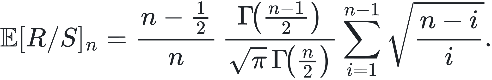</picture>

- Over window sizes 8–64 (those used in our 128-day estimator), this implies a slope of **0.617 for pure noise**.
- Our measured Ĥ = 0.589 on BTC is statistically indistinguishable from the 0.594 obtained on **randomly shuffled** BTC returns.
- The apparent "persistence" is estimator bias, so the "trade when H > 0.5" filter is a constant.

### M3.10 Markov switching and the HMM: classifiers of variance, not of mean
The forward (filtered) recursion is

<picture><source media="(prefers-color-scheme: dark)" srcset="figures/math/eq12-dark.svg">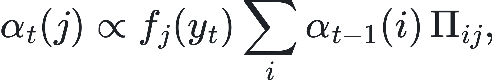</picture>

and the one-step predictive mean is

<picture><source media="(prefers-color-scheme: dark)" srcset="figures/math/eq13-dark.svg">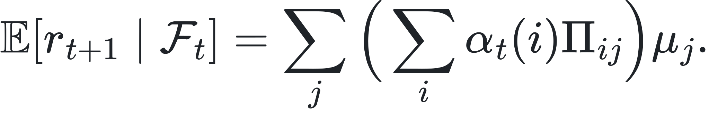</picture>

- **The states differ in variance, not in mean.** Our fitted states have μj ≈ 0.000 and 0.001 per day, but log-volatility levels corresponding to about 26% and 66% annualised.
- So the predictive mean is about zero whatever the filtered probabilities are. The model is an excellent **volatility** classifier (next-week vol 0.59 vs 0.47 across its states) and contains no first-moment information.
- Persistence Π11=0.83, Π22=0.90 (expected durations 1/(1−Πii) ≈ 6 and 10 days) matches the persistence of our market states.

### M3.11 PCA + K-means under heavy tails: degenerate clusters
Lloyd's algorithm minimises Σi ‖ xi − ck(i)‖2.
- With power-law features (α ≈ 3), the second moment is dominated by a handful of extreme observations, so new centroids are placed to absorb the tails.
- The bulk of the distribution collapses into one cluster: 90.5% (BTC) and 93.5% (ETH) of days.
- The clustering partitions *outliers versus everything else* and does not discover regimes.

### M3.12 Short-term trading: the break-even hit rate
- A trade with symmetric take-profit and stop at ± kσ and round-trip cost c has expected value

<picture><source media="(prefers-color-scheme: dark)" srcset="figures/math/eq14-dark.svg">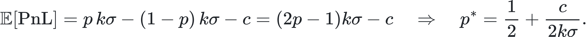</picture>

- With k=1, daily σ ≈ 3% and c = 0.30%, the break-even hit rate is p* = 0.55.
- Our dip trades hit the target first in 24 of 49 decided cases (p̂ = 0.49), so they **must** lose, and they did (−8.2% out of sample).
- The ML filter would have needed to lift p by 6 points, which requires an AUC far above the 0.535 achieved.

### M3.13 Machine learning: effective sample size and the Bayes-error floor
- Labels over h-day horizons overlap, so the **effective number of independent observations** is neff ≈ T/h. Two years of daily data with h=7 gives neff ≈ 100.
- The Hanley–McNeil standard error of an AUC near 0.5 is then

<picture><source media="(prefers-color-scheme: dark)" srcset="figures/math/eq15-dark.svg">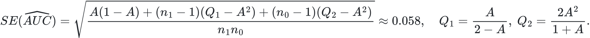</picture>

- So any AUC inside about 0.5 ± 0.11 is noise. Our daily direction models (0.40–0.51) all sit in that band.
- The hourly model (0.535, 95% interval 0.496–0.577) sits at its edge, and the shuffled-label **placebo** reached 0.512–0.52.
- **Bias–variance view:** when the signal-to-noise ratio is this low, the irreducible (Bayes) error dominates. Extra model capacity only adds variance, which is why gradient boosting *underperformed* the linear HAR model for volatility (Diebold–Mariano test, p=0.005).

### M3.14 Reinforcement learning: sample complexity and a non-Markov environment
- Even in the most favourable setting (a generative model of the environment), learning an ε-optimal policy needs on the order of

<picture><source media="(prefers-color-scheme: dark)" srcset="figures/math/eq16-dark.svg">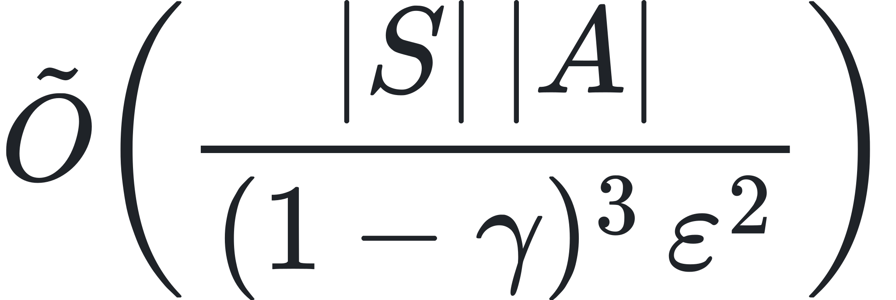</picture>

samples.
- With |S||A| = 256 and γ = 0.95, this is 256 × 8000 / ε2 ≈ 2×106/ε2 transitions, against 365 per year of data.
- Q-learning's convergence theorem also needs every state–action pair visited infinitely often and **stationary** transition probabilities. A market whose dynamics change by regime (M3.2) violates both.
- The agent memorised one bull year and held leverage into the 2022 crash (−79% across all seeds).

## M4. Why the volatility side works

### M4.1 Realised measures: quadratic variation, jumps and semivariance
For a jump-diffusion dln Pt = μtdt + σtdWt + dJt, the sum of squared intraday returns converges to the **quadratic variation**:

<picture><source media="(prefers-color-scheme: dark)" srcset="figures/math/eq17-dark.svg">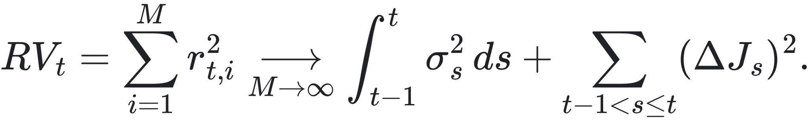</picture>

The **bipower variation**, with μ1 = 𝔼|Z| = √(2/π),

<picture><source media="(prefers-color-scheme: dark)" srcset="figures/math/eq18-dark.svg">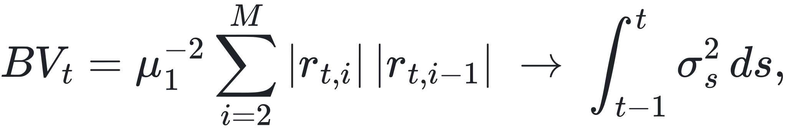</picture>

converges to the **integrated variance alone** (Barndorff-Nielsen & Shephard), so RV − BV isolates the jump component.

The **realised semivariances** RS±t = Σi rt,i2𝟏{rt,i ≷ 0} split RV by sign. Our forecasting regressions give:

| Component | Coefficient on next week's variance |
|---|---|
| smooth (bipower) | 0.58 |
| jump | 0.08 |
| downside semivariance | 0.45 |
| upside semivariance | 0.21 |

Smooth risk persists and jumps fade; **bad** volatility persists about twice as much as good. This is the formal basis of the storm brake's forecast √(365·EWMA30(0.5BV + RS−)).

### M4.2 Range-based estimators
- Parkinson's estimator σ̂2 = (ln H/L)2 / (4ln 2) uses the daily range. For a driftless Brownian motion its variance is about one fifth of that of the squared close-to-close return.
- Empirically, its correlation with next-day realised variance is 0.58, against 0.38 for the squared daily return and 0.62 for hourly RV.
- This is why CTR's volatility percentile uses Parkinson volatility, and why the daily-candle fallback costs almost nothing (Sharpe 1.17 vs 1.16).

### M4.3 The HAR model: a volatility cascade
Corsi's heterogeneous autoregressive model approximates long memory with three horizons:

<picture><source media="(prefers-color-scheme: dark)" srcset="figures/math/eq19-dark.svg"></picture>

- Fitted on 2021–22, the coefficients were β̂d=0.29, β̂w=0.51, β̂m=0.13. The weekly component dominates, the signature of a market populated by traders with different horizons.
- Out of sample (2023), R2 = 0.60 for BTC, with 34% lower error than a random-walk forecast.
- This predictability of σt+1 is what every sizing layer exploits.

### M4.4 Proposition: volatility-managed exposure raises the Sharpe ratio
**Setting.** Assume rt+1 = μ + σtεt+1, with σt known at t and ε i.i.d. with mean 0 and variance 1, independent of σt.

**Constant exposure.** The Sharpe ratio is SR0 = μ/√(𝔼[σt2]).

**Managed exposure.** For wt = c/σt:

<picture><source media="(prefers-color-scheme: dark)" srcset="figures/math/eq20-dark.svg"></picture>

**Result.** For daily data μ2 Var(σ−1) ≈ 0. Applying **Jensen's inequality** twice (convexity of x↦ 1/x, concavity of √·):

<picture><source media="(prefers-color-scheme: dark)" srcset="figures/math/eq21-dark.svg"></picture>

**Condition.** The proof requires μ to be roughly independent of σt. Our regime tables confirm this for BTC: mean returns do not differ across volatility terciles, all |t| < 1.5.

Our ablation measured the gain directly: the volatility layer moved Sharpe from 0.99 to 1.06 and cut the maximum drawdown from −47% to −38%.

### M4.5 Kelly growth and the calm-trend leverage cap
- The growth-optimal (Kelly) exposure under log utility is f*t = μt/σt2.
- In calm, orderly trends, both terms move favourably: the research shows positive trend payoff (μt > 0) in 4 of 4 years, and σt is below its median.
- So f* is largest exactly in the calm-trend state. CTR caps exposure at 1.5×, a fractional-Kelly safeguard against estimation error in μt, which (M2c) is the least reliable quantity in the system.

### M4.6 Volatility drag and the arithmetic of drawdowns
Geometric growth satisfies g ≈ μ − ½σ2.
- At BTC's 65% annual volatility the drag is about 21% a year. Halving exposure in storms reduces the drag on those days by three quarters.
- Recovering from a loss L requires a gain L/(1−L). Buy-and-hold's −76.6% drawdown needed **+327%** to recover, CTR-S's −29.6% only **+42%** (the long-only CTR's −37.5%: +60%).
- This asymmetry, not superior prediction, is why CTR-S ended with about 1.6× buy-and-hold's final equity while capturing less of each bull market. The short side applies the same arithmetic: a flat 2022 (−1% instead of −16%) means the 2023–24 bull market compounds from a 17% higher base.

### M4.7 Trend-quality measures and their random-walk baselines
- **Efficiency ratio** ERn = |Pt − Pt−n| / Σi=1n|Δ Pt−i+1|. For a driftless Gaussian walk, 𝔼|Sn| = σ√(2n/π) and 𝔼Σ|Δ P| = nσ√(2/π), so

<picture><source media="(prefers-color-scheme: dark)" srcset="figures/math/eq22-dark.svg">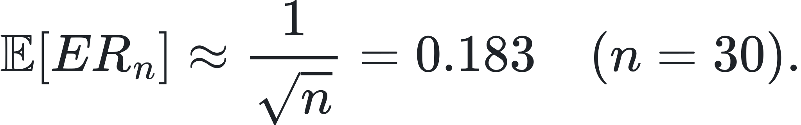</picture>

  Simulation gives 0.183–0.187; BTC averages 0.213. The market is close to a random walk on average, and only the days well above that baseline (our "efficient" condition) carry trend.
- **Choppiness index** CIn = 100log10(Σ TR / (max H − min L))/log10 n. Path length scales like n and range like √n, so CIn → 50 + O(1/log n) for a random walk. A simulation with hourly-built candles gives 47.2; **BTC averages 49.7**.
- **The consequence for CTR:** choppiness is BTC's normal state, and CI < 38.2 marks paths markedly straighter than chance (14% of days). That is exactly where trend payoff was positive in 4 of 4 years.

### M4.8 The 7-vote ensemble: variance reduction and turnover
- If K signals have common variance σ2 and pairwise correlation ρ, their average has variance σ2(ρ + (1−ρ)/K). For K=7 and ρ≈0.7 that is 74% of a single signal's.
- More importantly, the vote share moves in steps of 1/7, so the expected turnover 𝔼|Δ wt|, and with it the cost c𝔼|Δ wt|, is a fraction of a binary rule's.
- **Mixing horizons:** the votes combine group delays from 9.5 to 99.5 days (M3.5), so the position reacts partly early and partly late, instead of fully at one arbitrary lag. This is why the result is insensitive to the exact lookbacks while a single 30-day rule is not (Sharpe 1.08 at 30 days vs 0.77 / 0.68 at 20 / 45 days).

## M5. Multiple testing: how much of the result could be luck?

If N independent zero-skill strategies are tested over T years, the expected maximum Sharpe ratio is (Bailey & López de Prado)

<picture><source media="(prefers-color-scheme: dark)" srcset="figures/math/eq23-dark.svg">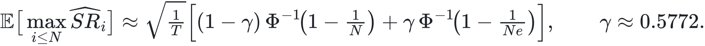</picture>

For T=4:

| Independent trials N | Expected best Sharpe by luck |
|---|---|
| 10 | 0.79 |
| 100 | 1.27 |
| 1,000 | 1.63 |

**Honest reading.**
- About 1,000 BTC backtests were logged. Treated as independent, they could produce a Sharpe of 1.16 by chance.
- They are not independent: they are small variations of about a dozen design families (neighbour checks, cost stresses, ablations of the same rules). The effective N is of order 10–20, for which the luck benchmark is about 0.8–1.0.
- This is why the evidence for CTR-S does not rest on the 2021–24 Sharpe alone. It also rests on:
  1. **stable neighbours:** every neighbouring setting keeps at least 96% of the Sharpe;
  2. **consistency:** every calendar year positive or better than BTC;
  3. **cold starts:** a mean Sharpe of 1.49 across 11 cold-start runs (long-only CTR 1.56);
  4. **longer history:** 2018–2020 and 2026, on which no parameter was set: +4,263% vs +545% over 2018 – Oct 2026, Sharpe 1.30.

  None of these can be produced by selecting the luckiest of many trials.

## References
- Andersen, T., Bollerslev, T., Diebold, F., Labys, P. (2003). Modeling and forecasting realized volatility. *Econometrica*.
- Anis, A., Lloyd, E. (1976). The expected value of the adjusted rescaled Hurst range of independent normal summands. *Biometrika*.
- Azar, M., Munos, R., Kappen, H. (2013). Minimax PAC bounds on the sample complexity of reinforcement learning with a generative model. *Machine Learning*.
- Bailey, D., López de Prado, M. (2014). The deflated Sharpe ratio. *Journal of Portfolio Management*.
- Barndorff-Nielsen, O., Shephard, N. (2004). Power and bipower variation with stochastic volatility and jumps. *Journal of Financial Econometrics*.
- Barndorff-Nielsen, O., Kinnebrock, S., Shephard, N. (2010). Measuring downside risk: realised semivariance. In *Volatility and Time Series Econometrics*.
- Corsi, F. (2009). A simple approximate long-memory model of realized volatility. *Journal of Financial Econometrics*.
- Grinold, R. (1989). The fundamental law of active management. *Journal of Portfolio Management*.
- Hamilton, J. (1989). A new approach to the economic analysis of nonstationary time series and the business cycle. *Econometrica*.
- Hanley, J., McNeil, B. (1982). The meaning and use of the area under a ROC curve. *Radiology*.
- Hill, B. (1975). A simple general approach to inference about the tail of a distribution. *Annals of Statistics*.
- Kelly, J. (1956). A new interpretation of information rate. *Bell System Technical Journal*.
- Lempérière, Y. et al. (2014). Two centuries of trend following. *Journal of Investment Strategies*.
- Lo, A., MacKinlay, C. (1988). Stock market prices do not follow random walks: evidence from a simple specification test. *Review of Financial Studies*.
- López de Prado, M. (2018). *Advances in Financial Machine Learning*. Wiley.
- Lorden, G. (1971). Procedures for reacting to a change in distribution. *Annals of Mathematical Statistics*.
- Moreira, A., Muir, T. (2017). Volatility-managed portfolios. *Journal of Finance*.
- Page, E. (1954). Continuous inspection schemes. *Biometrika*.
- Parkinson, M. (1980). The extreme value method for estimating the variance of the rate of return. *Journal of Business*.
- Patton, A., Sheppard, K. (2015). Good volatility, bad volatility: signed jumps and the persistence of volatility. *Review of Economics and Statistics*.
- Watkins, C., Dayan, P. (1992). Q-learning. *Machine Learning*.
- Wilder, J. W. (1978). *New Concepts in Technical Trading Systems*.
