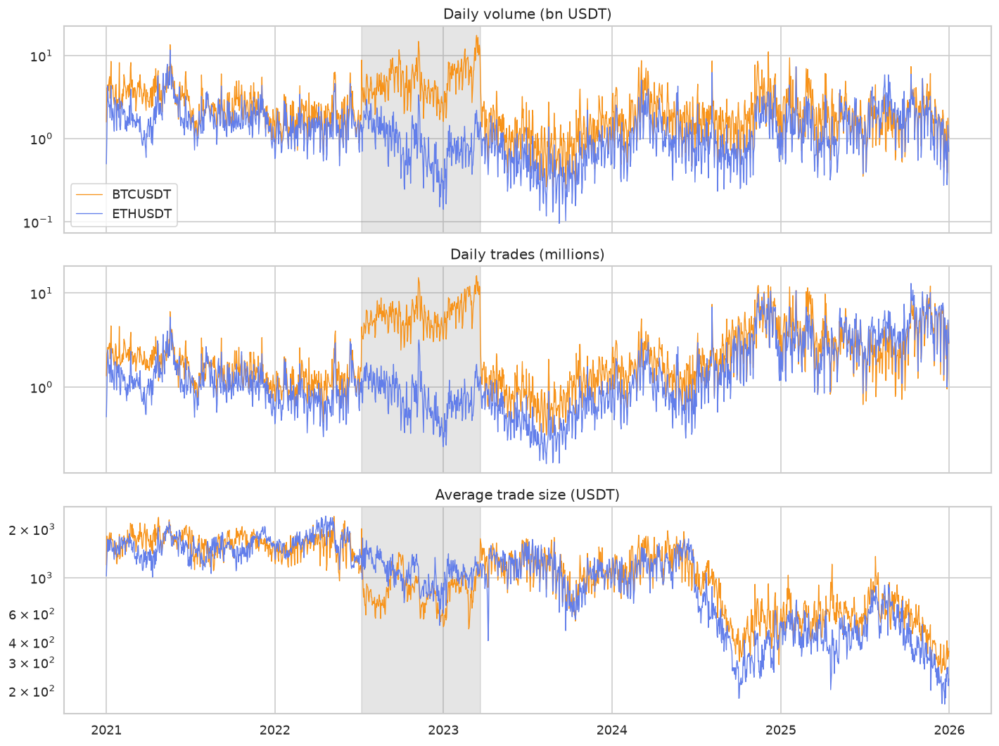
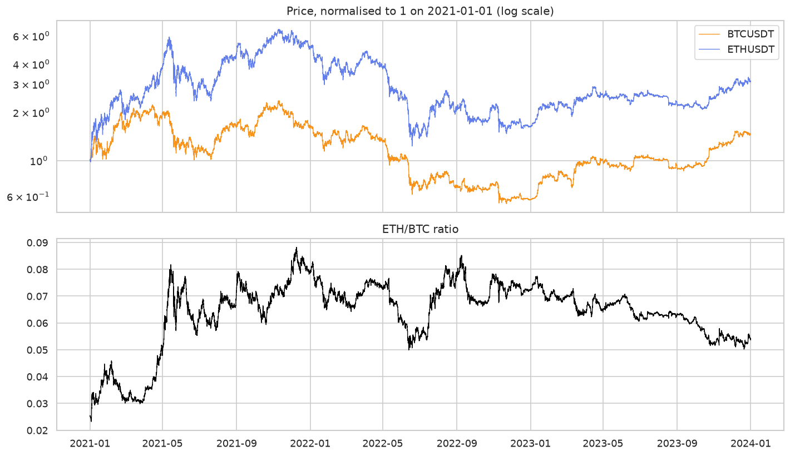
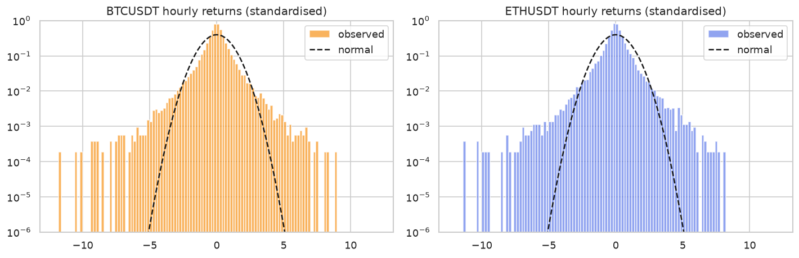
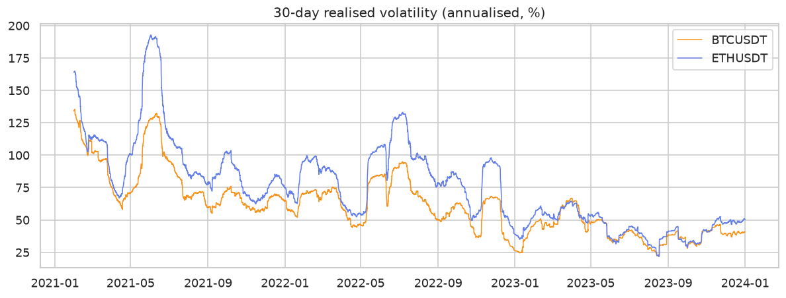
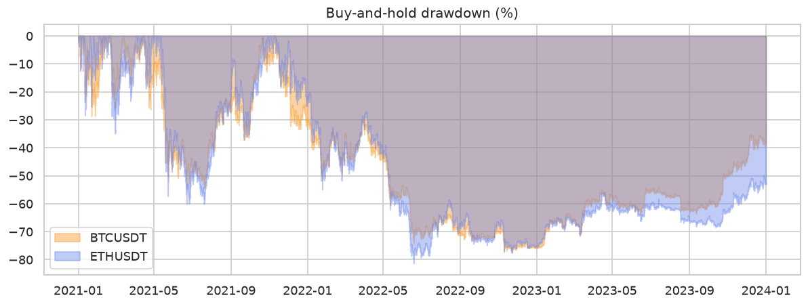
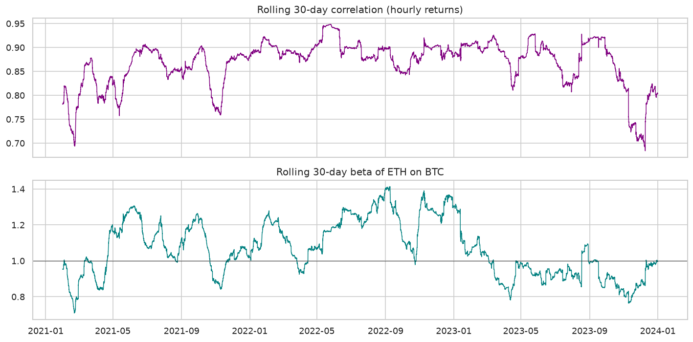
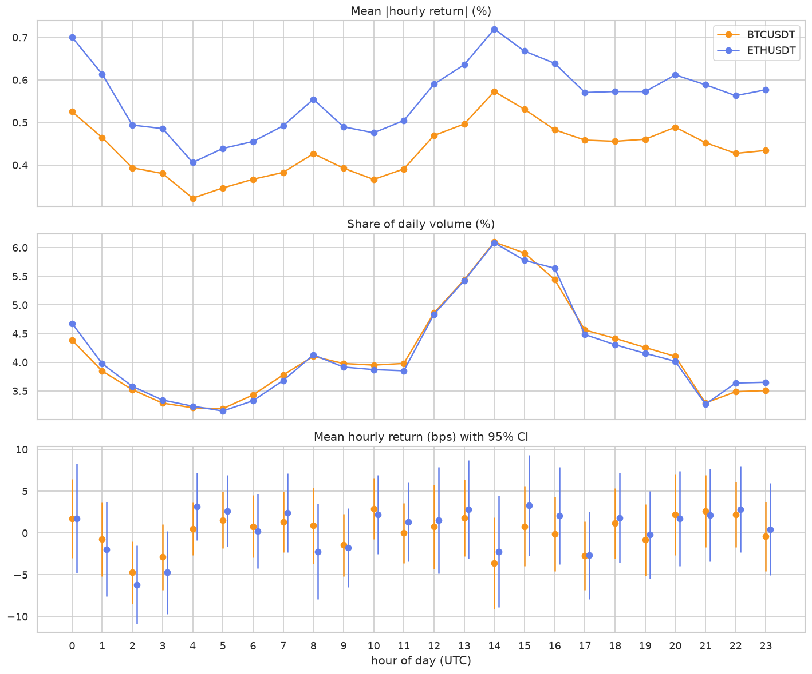
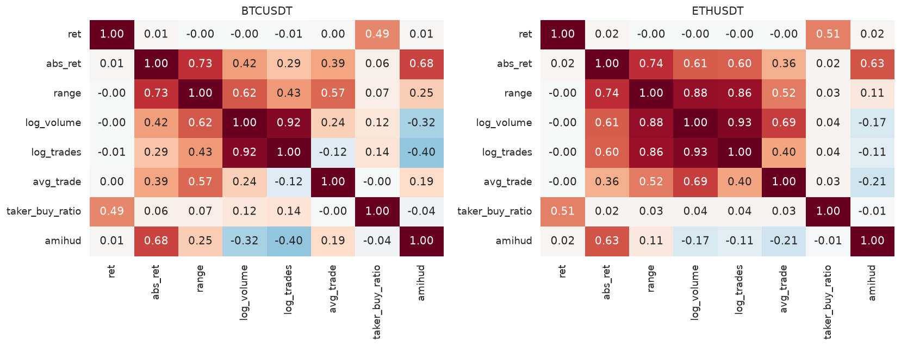
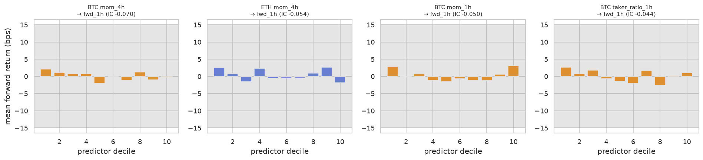

# BTC/USDT & ETH/USDT: Data Research Report

**Scope:** understanding the data before any strategy work.
**Notebook:** [`notebooks/01_data_research.ipynb`](../notebooks/01_data_research.ipynb). Every number here comes from it.
**Sample:** data quality is checked on the full 2021–2025 data. All statistical research uses **only the train split (2021-01-01 → 2023-12-31)**. Validation (2024) and test (2025) were not looked at, so they remain honest out-of-sample checks.

---

## Key takeaways

1. **The data is clean and trustworthy.** 14 missing hours (7 exchange outages) plus 3 outage bars that the current preprocessing doesn't flag. No corrupt prices. All extreme moves are genuine market events.
2. **Volatility is the most predictable thing in the data**, robustly and out of sample (HAR model: ~34% lower error than the naive forecast in 2023).
3. **Direction is close to unpredictable at useful horizons.** The one statistically robust directional effect (a 1–4 h reversal) is **smaller than trading costs**.
4. **Tails are extreme (tail index ≈ 3), and the biggest jumps arrive in calm markets**, not after volatility has already risen.
5. **BTC and ETH are one market** (correlation ~0.85), and they **crash together far more than they rally together**.
6. **The market's character changes year to year** (mean-reverting in 2021, trending in 2023 at weekly scale). Several attractive-looking patterns (ETH/BTC mean reversion, 30-day momentum, volume signals) **fail robustness checks**.
7. **Binance fee policy created a structural break in BTC volume and trade counts** (zero-fee period Jul 2022 – Mar 2023), so volume levels are not comparable over time.

---

## 1. What data exists and how trustworthy it is

### Inventory
| Dataset | Source | Frequency | Period | Rows |
|---|---|---|---|---|
| `data/raw/{BTC,ETH}USDT_1h.csv` | Binance spot REST API `/api/v3/klines` | 1 hour | 2021-01-01 00:00 → 2025-12-31 23:00 UTC | 43,810 each |
| `data/raw/{BTC,ETH}USDT_1d.csv` | same | 1 day | 2021-01-01 → 2025-12-31 | 1,826 each |
| `data/processed/1h/*` | derived: cleaned hourly, gaps filled, `is_filled`, returns | 1 hour | same | 43,824 each |
| `data/processed/4h/*`, `1d/*` | derived: aggregated from cleaned hourly | 4 h / 1 d | same | 10,956 / 1,826 |

Each processed folder is split into `train` (2021–23), `val` (2024) and `test` (2025).

**Variables per bar:** open, high, low, close (USDT); `volume` (base asset); `quote_volume` (USDT); `trades` (count); `taker_buy_base`/`taker_buy_quote` (volume where the aggressor bought).
**Timestamp convention:** `timestamp` is the bar's **open** time in UTC. The bar's close, high, low and volume are known only at `timestamp + 1h`. A signal computed on bar *t* can only be traded at bar *t+1* or later.

### Quality checks

| Check | Result |
|---|---|
| Missing hours | 14 hours in 7 outages (longest: 4 h on 2021-08-13), identical in both assets |
| Hidden outage bars | **3 bars not flagged:** 2021-02-11 03:00 and 2023-03-24 12:00 (zero volume, zero trades, exchange stopped at :40/:39), and 2021-04-25 04:00 (only 58 s of trading) |
| OHLC consistency, VWAP inside range, taker ≤ volume, positive prices | All pass, 0 violations |
| Open vs previous close | Median gap ≈ 1e-7; only 5 jumps > 0.1% (max 0.34%), all normal fast markets |
| Daily bars rebuilt from hourly vs Binance daily | Exact match |
| Extreme moves | All genuine: both assets move in the same direction with 2–25× normal volume. BTC-specific spikes on 2021-01-29 (+11.6%) and 2021-02-08 (+8.6%) coincide with the Musk "#bitcoin" and Tesla purchase news |
| Huge wicks | Genuine liquidation cascades (2021-05-19: BTC 30k–38k within one hour; 2021-12-04; 2025-10-10). **Kept.** |

**Verdict: trustworthy.** One fix recommended: flag the 3 hidden outage bars in `src/data/preprocess.py` (e.g. `trades == 0` → `is_filled`).

### Structural breaks in the activity data

- **Binance BTC zero-fee promotion (8 Jul 2022 – 22 Mar 2023, shaded).** BTC trades/day rose from 1.6M to 6.3M (3.8×), volume doubled and average trade size halved (1,687 → 870 USDT). ETH, which had no promotion, *declined* over the same period. When the promotion ended, BTC activity fell *below* its earlier level. The break lines up exactly with the promotion dates.
- **Average trade size fell sharply in late 2024–2025** for both assets. This is outside the train period and was only seen in the full-period quality chart, but it means validation and test come from a market with different microstructure.
- **Consequence:** absolute volume, trade count and trade size are **not stationary for reasons unrelated to price behaviour**. Any volume-based feature must be normalised against its own recent history.

---

## 2. Fundamental statistical characteristics

| (2021–23) | BTC | ETH |
|---|---|---|
| Annualised volatility | ~65% | ~85% |
| Hourly excess kurtosis | 15.7 | 13.4 |
| Daily excess kurtosis | 3.5 | 5.7 |
| Hourly skew | −0.19 | −0.59 |
| Tail index α (Hill, hourly) | 2.7–3.7 | 2.6–4.0 |
| Student-t dof (daily) | 2.5 | 2.9 |
| Moves > 4σ vs normal | ~135× more frequent | ~134× |

- **Heavy tails.** α ≈ 3 means variance is finite but the fourth moment probably isn't. Kurtosis estimates will jump around as data is added, so don't calibrate anything to them.
- **Negative skew, stronger for ETH.** ETH's crashes are sharper than its rallies.
- **Tails thin with horizon** (hourly kurtosis 15.7 → daily 3.5 for BTC) but remain clearly non-normal even at weekly.
- **Log prices are non-stationary; returns are stationary in mean** (ADF and KPSS agree). Return variance is not constant (Section 3).

### Discovery: jumps arrive in calm markets
Scaling hourly returns by past volatility normally *reduces* kurtosis, because it removes volatility clustering. Here it **increases** it (BTC 15.7 → 24.7). This holds for EWMA spans of 1 day, 1 week and 1 month.
The largest volatility-scaled shocks are ~5% hourly moves arriving when recent hourly volatility was ~0.25% (e.g. 2023-08-17, 2023-08-29), mostly in the quiet 2023 market. Removing just 5 such hours halves the scaled kurtosis.

- **How strong:** consistent across spans; driven by a few events, which is exactly what makes them dangerous.
- **What it means:** volatility-targeted sizing puts on the **largest** positions in calm markets, exactly where these jumps hit, and ATR stops get gapped through.
- **Next step:** the risk layer needs a volatility-independent hard cap on exposure, and backtests should fill stops at the bar's open when it gaps past the stop, or at worse prices, rather than at the exact stop price.

---

## 3. How behaviour changes through time

| Year | BTC return | BTC vol | BTC max DD | ETH return | ETH vol | ETH max DD |
|---|---|---|---|---|---|---|
| 2021 | +58% | 81% | −55% | +404% | 109% | −60% |
| 2022 | −64% | 64% | −67% | −67% | 87% | −77% |
| 2023 | +156% | 44% | −22% | +91% | 47% | −28% |

- **Volatility halved** from 2021 to 2023. 30-day vol ranged from 22% to 135% (BTC) and 22% to 193% (ETH).
- **Skew flipped** from negative (2021–22) to positive (2023).
- **Buy-and-hold:** max drawdown −77% (BTC) and −81% (ETH), and ~780 days underwater at the end of 2023. A strategy that avoids a large part of 2022 has a big edge on the drawdown-based parts of the evaluation.

- **The market's character changes:** BTC's weekly variance ratio was 0.83 (mean-reverting) in 2021, 1.05 in 2022 and 1.34 (trending) in 2023. ETH swings similarly. Any single fixed style (pure trend or pure mean reversion) is exposed to regime change.

---

## 4. Relationships within each asset and between the two

### Within each asset
- **Direction has almost no linear memory.** The Pearson autocorrelation of returns is ≈ 0 at all lags, and variance ratios are ≈ 1 at every horizon from 2 h to 20 days (no significant z).
- **The size of moves has long memory.** Absolute returns are autocorrelated for weeks, with a 24-hour cycle ([figure](figures/acf.png)). The autocorrelation of log realised variance is 0.63–0.71 at 1 day and 0.26–0.33 at 90 days.
- **Rank vs Pearson:** the Spearman lag-1 autocorrelation is −0.04 to −0.05 while Pearson is ≈ 0. Ordinary moves slightly reverse; the few huge ones don't, and they dominate Pearson.
- **Volatility has no leverage effect:** the GJR-GARCH asymmetry term is insignificant (p = 0.95 BTC, 0.68 ETH). Crypto volatility reacts about equally to up and down moves.
- **Integrated GARCH:** fitted persistence ≈ 1.0. This is a symptom of the shifting volatility level, not of literally permanent shocks; a single GARCH is mis-specified over this sample.

### BTC vs ETH

| | Value |
|---|---|
| Correlation (1h / 4h / 1d / 1w) | 0.85 / 0.85 / 0.82 / 0.83 |
| Rolling 30-day correlation range | 0.68 – 0.95 |
| ETH beta to BTC (mean, range) | 1.07 (0.71 – 1.41) |
| Share of ETH variance explained by BTC | 68–73% |
| Lead-lag at ±1 h | ≈ 0 (inside ±2 s.e.) |

**Tail dependence is asymmetric** (co-exceedance probability vs a normal distribution with the same correlation):

| | Crash together | Normal | Rally together | Normal |
|---|---|---|---|---|
| Daily, worst/best 1% | **82%** | 41% | 27% | 42% |
| Hourly, worst/best 1% | **65%** | 46% | 50% | 45% |

- **What it means:** holding both assets gives diversification in rallies but **none in crashes**. Portfolio-level risk limits should assume correlation ≈ 1 in stress.
- **Limitation:** the daily 1% tail is only ~11 observations; the hourly result (263 observations) points the same way.

---

## 5. Regimes, structural changes and anomalies

| Item | Type | Evidence |
|---|---|---|
| Volatility level halving 2021 → 2023 | Structural change | Yearly table, rolling RV, integrated GARCH |
| BTC zero-fee period | Exchange-made break in activity data | 3.8× trades, ETH as control |
| Trade-size collapse 2024–25 | Microstructure shift (val/test period) | Activity chart |
| Weekly trending vs mean-reverting flips by year | Regime dependence | Variance ratio per year |
| Jumps from calm | Anomaly vs standard vol models | Vol-scaled kurtosis |
| Hidden outage bars | Data anomaly | close_time < :59, zero trades |

**Conditional behaviour:**
- **Volatility regimes** (tercile of yesterday's 30-day vol): no significant difference in mean return (all |t| < 1.5). BTC–ETH correlation is slightly lower in high vol (0.82 vs 0.86). BTC's daily lag-1 autocorrelation in high-vol regimes is −0.14 (≈ −2.6 s.e.), a *hypothesis* of mean reversion under stress, but it's one unconfirmed test.
- **Trend regime** (close vs 200-day MA): next-day returns don't differ significantly (|t| ≤ 1.1), but **volatility is lower above the MA** (BTC 2.7% vs 3.3% daily). A trend filter is better as a *risk* switch than as a return signal.

**Seasonality**

- **Volatility and volume follow a stable daily cycle:** peak at 14–15 UTC (US open, ~30% above average), secondary peak at 00 UTC, trough at 04–06 UTC (~25% below). Year-to-year profile correlation is 0.65–0.71.
- **Returns have no reliable daily or weekly cycle:** year-to-year profile correlation is −0.16; 1 of 24 hours has |t| > 2 (1.2 expected by chance); no weekday has |t| > 1.1.
- **Weekends** have ~25% less volume, and Saturday's average absolute move is about half a weekday's.

---

## 6. Informative vs redundant variables

| Variable | Informative about | Strength | Notes |
|---|---|---|---|
| Last-hour range (high/low) | **Future volatility** | IC 0.36–0.39 with next-24h |move|, stable all years | Best single variable |
| Past 24h realised vol | **Future volatility** | IC 0.29–0.35, stable | |
| Daily high/low (Parkinson) | Next-day volatility | Corr 0.58–0.65 vs 0.38–0.42 for squared close return | Always use range with daily bars |
| Own 1–24h returns | Next 1–4h direction (reversal) | IC −0.04 to −0.07, t up to −11 | Economically too small (Section 7) |
| Taker buy ratio | Same-hour return (0.49–0.51, mechanical); next hour −0.03 to −0.04 | Weak | Mostly a proxy for own return; incremental only for BTC |
| Other asset's last-hour return | Next-hour reversal | Weak | Incremental only for ETH (t ≈ −3.5) |
| Volume surprise | Future volatility | IC 0.10–0.12 overall | **Sign flips between years**, so fragile |
| `log_volume` vs `log_trades` | – | Rank corr 0.92 | Redundant: keep one |
| `range` vs `abs_ret` | – | Rank corr 0.73 | Heavily overlapping |
| Amihud illiquidity | – | Rank corr 0.68 with |ret| | Mostly |return| in disguise |
| Hour-of-day / weekday | Volatility: yes; returns: no | | |

---

## 7. Robust vs fragile relationships

### Robust
- **Volatility clustering and forecastability.** A HAR model fitted on 2021–22 has out-of-sample R² 0.60 (BTC) and 0.73 (ETH) on 2023, and **34% lower MSE than "tomorrow = today"**. The weekly component carries the most weight.
- **Intraday volatility and volume cycle** (stable across years).
- **Fat tails and asymmetric crash dependence** (consistent across horizons and thresholds).
- **Short-term reversal, statistically:** 33 of 78 predictive tests have |t| > 2 (3.5 expected by chance), 17 have |t| > 3 (0.2 expected), and they keep the same sign in all three years.

### Real but economically insufficient
**Short-term reversal:**

| Signal → target | Extreme-decile spread | Round-trip cost |
|---|---|---|
| BTC 4h return → next 1h | 2.3 bps | 30 bps |
| BTC 4h return → next 4h | 12.9 bps | 30 bps |
| ETH 4h return → next 4h | 14.6 bps | 30 bps |

On its own it can't pay for 0.15% per trade. Its use is **entry timing**: don't enter right after a 4-hour spike. The last-hour return also shows a **U-shape**: both extreme deciles are followed by slightly positive returns, a non-linearity that linear models miss.

### Fragile: looks interesting, fails robustness
- **ETH/BTC mean reversion.** Full-sample ADF p = 0.017 and cointegration p = 0.054, but ADF p ≥ 0.19 in **every single year**. The full-sample result comes from one round trip in the ratio (up in 2021, down in 2022–23).
- **Daily time-series momentum.** The 30-day lookback shows BTC +64% a year, but neighbouring lookbacks (20, 45, 90 days) give much weaker or negative results, and no lookback reaches |t| = 2. Picking 30 days would be overfitting.
- **Volume surprise → volatility:** strong overall, sign flips by year.
- **Hour-of-day return effects:** profiles anti-correlated across years.
- **BTC mean reversion in high-vol regimes:** one test, t ≈ −2.6, needs confirmation.

---

## 8. Important characteristics of this market

1. **It's a volatility market more than a direction market.** The size of the next move is far more forecastable than its sign. Risk management and position sizing are where the data offers the clearest edge.
2. **Two assets, one factor.** ETH ≈ 1.07 × BTC plus independent noise with ~45% annual vol, and the pair behaves as one asset in crashes.
3. **Regimes dominate.** Three years gave three different markets (bull, bear, recovery) with different volatility levels and different trend/reversion character.
4. **Danger comes out of calm.** The largest shocks relative to recent volatility happen in quiet markets.
5. **Trading costs are large relative to short-horizon edges.** 30 bps per round trip wipes out every hourly effect found. Viable strategies must trade infrequently and hold for days, not hours.

---

## 9. Open questions

- Is the short-term reversal still present in 2024–25, given the collapse in trade size?
- Does the high-vol mean reversion hint (BTC) survive in validation?
- Can a regime classifier (volatility level + trend) identify **ex ante** when trend-following works (2023-like) vs fails (2021-like)?
- Is the "jumps from calm" pattern linked to specific catalysts (macro releases, US hours, weekends) that could be anticipated?
- How much of the 2022 drawdown could a volatility- or trend-based risk switch have avoided without overfitting to that one crash?

## 10. Additional data that would materially improve the analysis

| Data | Why |
|---|---|
| **Perpetual futures funding rates and open interest** (Binance futures) | Measure leverage and crowding; the most direct predictor of liquidation cascades |
| **Liquidation data** | Explains the wicks and jump-from-calm events |
| **Minute or tick trades, order book depth** | Lead-lag (BTC→ETH lives at seconds–minutes), realistic slippage, better realised volatility |
| **Other exchanges** (Coinbase, OKX) and the Coinbase premium | Venue-independent volume; US vs offshore demand |
| **Options implied volatility** (Deribit DVOL) | A forward-looking volatility measure, likely better than any historical-vol forecast |
| **Macro** (US rates, DXY, S&P 500, CPI/FOMC dates) | Crypto's biggest 2022 moves were macro-driven |
| **Stablecoin supply and exchange net flows** (on-chain) | Liquidity entering or leaving the market |
| **Pre-2021 history** | More regimes (2018 bear, 2020 COVID crash) for robustness testing |

## 11. Where to research next

1. **Volatility forecasting → position sizing.** HAR-type models with range-based inputs, plus a volatility-independent exposure cap. Highest confidence of payoff.
2. **Regime detection.** Combine the volatility level, the 200-day trend state and variance ratios into a regime label; test whether trend-following works conditionally.
3. **Slow directional signals only.** Given the costs, focus on holding periods of days to weeks, tested with walk-forward validation across lookback *ranges*, not single lookbacks.
4. **Crash-aware risk.** Joint BTC+ETH exposure limits that assume correlation → 1 in stress; stop logic that assumes gap-through fills.
5. **Fix the preprocessing** for the 3 hidden outage bars, and make all volume features relative (z-scores against trailing windows).
6. **Validation-period check (2024)** of every "robust" finding above, before any strategy is tuned.
