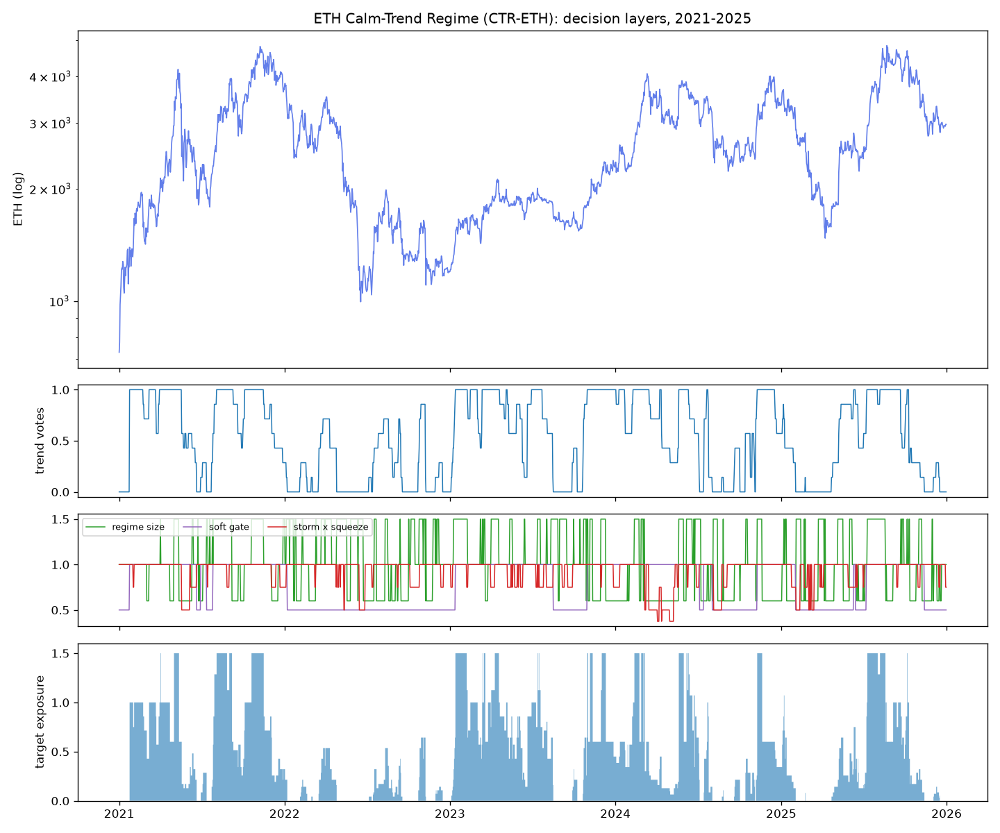
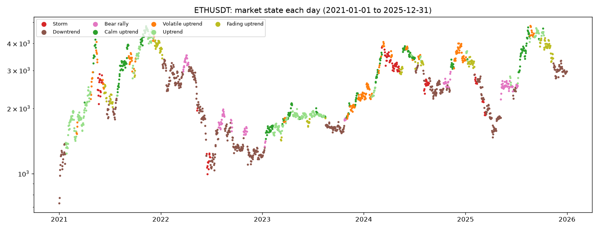
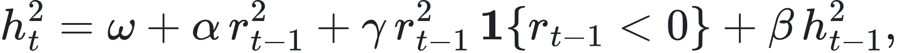
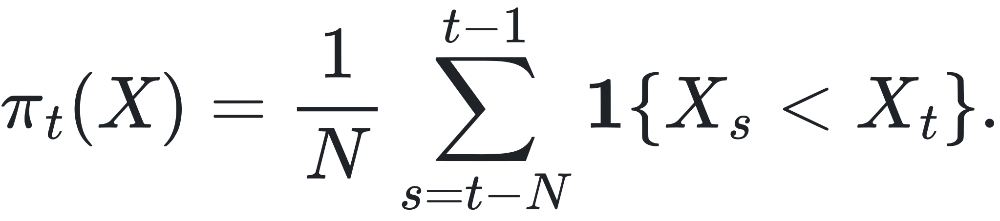
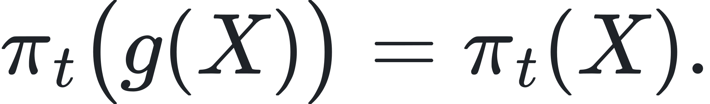
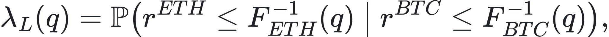
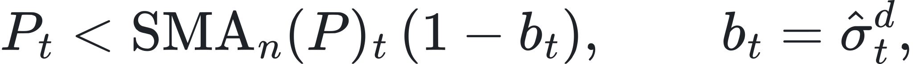
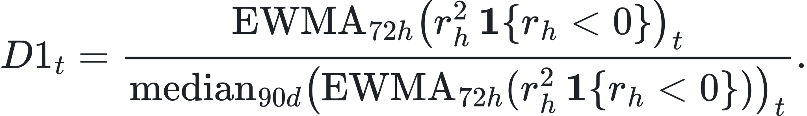
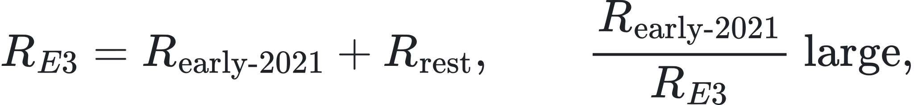
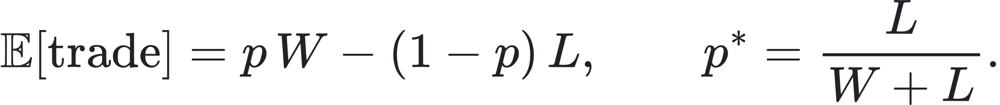

# ETH/USDT Strategy: Calm-Trend Regime for ETH (CTR-ETH), full technical document

Part I describes the strategy, its ETH-specific reasoning, risk plan and results. **Part II gives the mathematical foundations specific to ETH:** its return process, why the same rules adapt to it, why ETH-specific designs failed, and the crash-risk analysis. The general derivations shared with BTC (why directional indicators fail, realised measures, volatility management) are in `reports/btc_strategy.md` Part II. A short version is `reports/eth_strategy_summary.md`.

# Part I: The strategy

**Status: final and frozen** (evaluation protocol v20 §26). It is the market-state framework of the BTC strategy, applied to ETH **with no parameter changed**. Every threshold is measured against ETH's own history, so the rules adapt to ETH's higher volatility and sharper cycles without any tuning.

| | |
|---|---|
| **Market** | ETH/USDT, Binance spot, daily decisions (hourly data for the risk measures) |
| **Style** | Long-only trend following with regime-based position sizing |
| **Capital and costs** | 10,000 USDT; 0.15% fee + slippage on every fill; maximum position 1.5× equity; borrowed USDT charged 8% a year |
| **Code** | `src/strategies/eth_strategy.py` (strategy), `src/strategies/market_state.py` (framework), `src/strategies/execution.py` (execution settings) |
| **Run** | `.venv/bin/python -m scripts.run_eth_strategy` → `results/eth/` (all metrics, equity, trades, charts) |
| **Behaviour profile** | `.venv/bin/python -m scripts.market_state_report ETHUSDT 2021-01-01 2025-12-31` → `results/eth/market_state_2021_2025/` |
| **Tests** | `tests/test_eth_strategy.py` (no lookahead, bounded targets, frozen results) |

## Results at a glance

| Period | CTR-ETH return | ETH buy-and-hold | CTR-ETH Sharpe | B&H Sharpe | CTR-ETH max DD | B&H max DD |
|---|---|---|---|---|---|---|
| 2021–2024 | +274% | +357% | **0.90** | 0.87 | **−37.3%** | −79.3% |
| 2025 | **+54.9%** | −11.8% | **1.23** | 0.20 | **−25.0%** | −60.0% |
| **2021–2025 (required 5-year backtest)** | **+482%** | +306% | **0.96** | 0.75 | **−37.3%** | −79.3% |
| **2026-01-01 → 10-04 (unseen data, run once)** | **+28.3%** | −9.5% | **1.30** | 0.10 | **−8.9%** | −53.3% |

Over 2021–2025 it beat buy-and-hold in 50% of quarters, and in **7 of the 8 quarters where ETH fell**. It ended with 58,169 USDT against buy-and-hold's 40,646.

---

## 1. Why this strategy for ETH: what the data told us

ETH is BTC's louder sibling. It shares BTC's structure but every feature is amplified:

| Property | ETH | BTC | Source |
|---|---|---|---|
| Annual volatility | ~85% | ~65% | notebook 01 §4 |
| Hourly skew (crash asymmetry) | −0.59 | −0.19 | notebook 01 §4 |
| Volatility forecastable out of sample (HAR R², 2023) | **0.73** | 0.60 | notebook 01 §7 |
| Buy-and-hold max drawdown 2021–24 | −79% | −77% | notebook 01 §9 |
| Best single year | **+399% (2021)** | +156% (2023) | notebook 01 §9 |
| Share of variance explained by BTC | 68–73% | – | notebook 01 §11 |
| Crashes together with BTC / rallies together (worst/best 1% of days) | 82% / 27% | – | notebook 01 §11 |

Four ETH facts shaped the decision:
1. **Direction is no more predictable than for BTC.** Every direction indicator, including those from the cited reference report, had ICs that flip sign by year (notebook 02 §5–10).
2. **ETH's volatility is even more predictable than BTC's** (HAR R² 0.73), so volatility-based sizing works at least as well.
3. **ETH's gains are concentrated in violent rallies and its losses in sharp crashes.**
   - Its 2021 return was +399%.
   - Bullish ETH readings come with higher volatility (4 of 4 years).
   - A strategy must be fully invested in the big rallies and quick to step aside in the crashes.
4. **Trend-following pays in calm, orderly ETH trends.** In the low-volatility trending regime, 30-day momentum paid +2.3% per week on average, positive in 4 of 4 years, and nothing in stormy regimes (notebook 02 §9). This is the same structure as BTC.

So the same split works: **a robust trend signal decides *whether* to be long; ETH's own regime decides *how much*.**

## 2. The rules (identical to the BTC strategy)

Evaluated at each daily close; orders fill at the **next day's open**.

| Step | Rule | Values |
|---|---|---|
| 1. Direction | Share of 7 trend votes: is ETH's close above its 20, 30, 50, 75, 100, 150 and 200-day average? Each vote has a hysteresis band of 1 × daily volatility. | 0 to 1 |
| 2. Regime | **Calm trend** = volatility percentile ≤ 0.5 *and* 30-day efficiency ratio above its own expanding median, *or* Choppiness(14) < 38.2. **Stormy** = volatility percentile > 0.5. | × 1.5 calm trend, × 0.6 stormy, × 1.0 otherwise |
| 3. Storm brake | Sell-off risk forecast = √(365 · EWMA₃₀(0.5 · bipower variation + downside semivariance)), from hourly ETH data. Brake when it exceeds 1.5 × its own 1-year median. | × 0.5 |
| 4. Squeeze | Bollinger Bands (20, 2) inside the Keltner Channel (20, 1.5 ATR) | × 0.75 |
| 5. Long-term gate | Banded 200-day trend state is down | × 0.5 |

**Target exposure** = steps 1 × 2 × 3 × 4, capped at 1.5, then × step 5.

**Execution:**
- An open position is resized only when the target moves by more than 0.25.
- The strategy waits 5 days before re-entering after an exit.
- No orders are placed on exchange-outage bars.

## 3. Why the *same* rules are the right ETH strategy

The competition asks for a strategy *tailored to* each market. CTR-ETH is tailored through **self-referenced thresholds**, not through different numbers:
- "Stormy" means stormy **for ETH**: its 14-day volatility ranked against ETH's own previous year. ETH's 85% volatility is not compared with BTC's 65%.
- The storm brake compares ETH's sell-off risk with **ETH's own** 1-year median.
- "Efficient" compares ETH's efficiency ratio with **ETH's own** history.
- The trend votes use ETH's own prices and ETH's own daily volatility for the hysteresis band.

Part II, §E2, proves why this works: rank-based thresholds are invariant to the level of volatility, so the *same rule* produces an ETH-calibrated regime map.

**ETH-specific alternatives were built and tested, and they failed** (all pre-registered in `docs/evaluation_protocol.md` §22–§25):

| ETH-specific idea | Result (2021–24 unless stated) | Stage |
|---|---|---|
| Slow long-term direction alone (200-day, vote share, breakout, golden cross, momentum) | Best Sharpe 0.79, below buy-and-hold's 0.87; drawdowns 53–62% | 18 |
| 200-day + full 1.5× when all votes agree + D1 crash brake (E3) | Sharpe 0.95, +371%, but only 6/16 quarters beating B&H, failed the cold-start test; 2025 −11.2% | 20 / 20c |
| Fixes for E3 (hysteresis, cold-start rules, early entry) | All worse (Sharpe 0.59–0.80). They revealed E3's return depended on 1.5× in early 2021. | 20b |
| Old ETH final G-06 | 2021–25 Sharpe 0.83, max DD −56.7%; 2025 −7.8% | 4e / 20c |
| **The BTC framework unchanged (CTR-ETH)** | **2021–25 Sharpe 0.96, +482%, max DD −37.3%; 2025 +54.9%; 2026 +28.3%** | 12 / 20c / 21 |

Identical rules on both coins is also the strongest guard against overfitting: **no ETH parameter was tuned at all**.

## 4. ETH market states

The same seven named states, measured on ETH (2021–2025):

| State | Share of days | Average spell | CTR-ETH exposure | Next-week vol (descriptive) |
|---|---|---|---|---|
| Storm | 7% | 11 days | 0.10 | 0.79 |
| Downtrend | 34% | 27 days | 0.04 | 0.70 |
| Bear rally | 7% | 11 days | 0.40 | 0.72 |
| **Calm uptrend** | 15% | 10 days | **1.38** | **0.64** |
| Volatile uptrend | 12% | 9 days | 0.52 | 0.72 |
| Uptrend | 17% | 10 days | 0.84 | 0.62 |
| Fading uptrend | 9% | 11 days | 0.26 | 0.71 |

- **ETH spends more time in storms than BTC** (7% vs 4%), and its spells last longer (10–11 days vs 6–7).
- The calm uptrend was followed by the best average week (+2%), and that is where the strategy is largest.

## 5. Risk management plan (ETH-specific)

### 5.1 How position size is controlled
- **At most 1.5× equity, only in calm ETH trends.** On stormy days at most 0.6×; in a slow downtrend at most 0.3–0.75×.
- **ETH's crash risk is handled by three layers:**
  - the storm brake reacts to ETH's sell-off volatility from hourly data;
  - the squeeze warning pre-empts volatility expansions;
  - the 200-day gate halves everything in ETH bear markets.
- **Joint risk with BTC.** ETH crashes together with BTC on 82% of the worst days. Anyone running both strategies should treat them as **one** risk position in crashes and size the pair accordingly. Diversification between them disappears exactly when it is needed.

### 5.2 Stop-loss rules
- **The exit is a trend-break stop.** The position is scaled down vote by vote as ETH falls through its 20–200-day averages, and closed when all votes are down.
- **Measured effect, 2021–2025 (21 trades):**
  - average loss −2.4% of equity;
  - largest loss −8.3% (July 2024 entry, closed on 3 August 2024 before the 5 August crash);
  - only 3 trades lost more than 6% of equity.
- **Why there is no fixed price stop:** on daily data a fixed stop sells dips that recover (tested on BTC: Sharpe 1.16 → 0.71). With ETH's larger swings the effect would be stronger.

### 5.3 Risk–reward (measured on equity, 2021–2025)
| | Value |
|---|---|
| Win rate | 23.8% |
| Average win / average loss (% of equity) | +56.0% / −2.4% |
| **Payoff ratio** | **23.4 : 1** |
| Profit factor | 5.06 |
| Expectancy per trade | +11.5% of equity |
| Break-even win rate at this payoff | 4.1% |

### 5.4 Known risks
- **Shocks from calm markets at 1.5×.** The worst days were −18.6% (7 Sep 2021), −16.0% (19 May 2021) and −12.3% (10 Oct 2025). The worst 7 days: −25.7%. Daily 95% VaR −3.5%, CVaR −5.9%.
- **Slow recovery:** the deepest drawdown (−37.3%) took 828 days to recover.
- **Lag in bull markets:** in 2021 it made +175% vs ETH's +399%, and it lags in strong bull quarters generally.
- **Cold start is weaker than on BTC:** started from scratch in 11 quarterly windows, its mean Sharpe was 0.62 vs buy-and-hold's 0.74, beating it in 5 of 11. It works better with some history before the evaluation period.

## 6. Results in detail (2021–2025, the required backtest)

**Required metrics:**

| Metric | Value | | Metric | Value |
|---|---|---|---|---|
| Gross Profit | 60,041.03 USDT | | Buy-and-Hold Return | +306.46% |
| Net Profit | 48,168.68 USDT | | Largest Losing Trade | −3,360.95 USDT |
| Total Closed Trades | 21 | | Largest Winning Trade | 24,676.80 USDT |
| Win Rate | 23.81% | | Sharpe Ratio | 0.96 |
| Max Drawdown | −37.34% | | Sortino Ratio | 1.53 |
| Gross Loss | −11,872.35 USDT | | Average Holding Duration | 64.3 days |
| Average Winning Trade | 12,008.21 USDT | | Maximum Holding Duration | 258 days |
| Average Losing Trade | −742.02 USDT | | | |

Extras: total return +481.7%, annualised +42.2%, Calmar 1.13, exposure 74%, fees 3,223 USDT, financing 753 USDT, Sharpe at 2× costs 0.91. Per-period tables, trade history, fills, equity and quarterly files are in `results/eth/<period>/`.

| Year | CTR-ETH | ETH | CTR-ETH max DD | ETH max DD |
|---|---|---|---|---|
| 2021 | +175.0% | +399.2% | −37.2% | −57.2% |
| 2022 | −20.2% | −67.5% | −22.5% | −74.0% |
| 2023 | +40.0% | +90.8% | −26.2% | −27.3% |
| 2024 | +21.8% | +46.3% | −33.6% | −45.3% |
| 2025 | +55.4% | −11.0% | −25.0% | −60.0% |

**The edge is defence plus leverage in calm trends:**
- in the two bad ETH years (2022, 2025) it lost 20% and *made* 55% while ETH lost 68% and 11%;
- in the bull years it kept 40–50% of ETH's gains;
- compounded, that beats holding ETH with half the drawdown.

## 7. Robustness (2021–2024 unless stated)
- **No lookahead:**
  - signals are identical when future data is removed;
  - the backtest matches when cut at any point;
  - a regression test locks the frozen results (`tests/test_eth_strategy.py`).
- **Neighbouring settings keep at least 90% of the Sharpe** (worst 0.81 vs 0.90): high-vol size 0.5 / 0.7 → 0.93 / 0.94; volatility threshold 0.4 / 0.6 → 0.85 / 0.98; storm brake 1.25 / 1.75 → 0.92 / 0.90; gate floor 0.3 / 0.7 → 0.92 / 0.81; gate lookback 150 / 250 → 0.86 / 0.87.
- **Double costs** (0.30% per fill): Sharpe 0.85 (2021–24), 0.91 (2021–25).
- **Daily candles only:** Sharpe 0.88 (vs 0.90 with hourly data).
- **Cold start:** mean Sharpe 0.62 vs buy-and-hold's 0.74 over 11 windows (weaker than BTC; see §5.4).
- **Unseen data (2026, run once, protocol §25):**

  | 2026 quarter | CTR-ETH | ETH |
  |---|---|---|
  | Q1 | −4.9% | −29.2% |
  | Q2 | −2.3% | −25.3% |
  | Q3 | +36.3% | +70.9% |

  Year to 4 Oct: +28.3% vs −9.5%, max DD −8.9% vs −53.3%. Results in `tries/results/stage21_eth_test_2026/`.

## 8. How it was chosen (honest history)
1. **Early stages:** the ETH final was G-06 (blend + agreement override + crash brake, at 1.5×).
2. **Long-term direction study (stage 18):** no slow indicator beats ETH buy-and-hold alone. ETH falls too fast for slow exits.
3. **Downside indicator research (stage 19):** a short-term downside semivariance ratio (D1) flags ETH's rough weeks (2.2× more of the worst weeks than chance).
4. **ETH round (stage 20, 20b):** D1 worked as a brake (Sharpe 0.84 → 0.95), but no ETH-specific design passed all gates. E3's edge depended on early 2021.
5. **2025 comparison (stage 20c):** 2025 had been used before (G-06's test). Comparing the candidates on it made it selection data. CTR-ETH was best: +54.9% vs ETH −11.8%.
6. **Selection (protocol v20 §26):** CTR-ETH, unchanged. Its unseen-data test is **2026**: +28.3% vs −9.5%.

---

# Part II: Mathematical foundations specific to ETH

Notation follows `reports/btc_strategy.md` §M1: log returns rt, filtration ℱt, positions wt adapted to ℱt and executed at the next open.

## E1. ETH's return process

The same location–scale representation holds:

<picture><source media="(prefers-color-scheme: dark)" srcset="figures/math/eth_eq01-dark.svg"></picture>

with ETH-specific magnitudes:
- **Heavier and more asymmetric tails.** Hourly excess kurtosis 13.4; Hill tail index 2.6–4.0; a Student-t fit to daily returns has ν ≈ 2.9; hourly skew −0.59 (three times BTC's).
- **Volatility persistence.** The autocorrelation of log realised variance is 0.71 at lag 1 and 0.33 at lag 90. HAR coefficients (fitted on 2021–22) are βd = 0.37, βw = 0.47, βm = 0.06, with out-of-sample R² = 0.73 in 2023.
- **No leverage effect.** In the GJR-GARCH(1,1) model the asymmetry term is

<picture><source media="(prefers-color-scheme: dark)" srcset="figures/math/eth_eq02-dark.svg"></picture>

  estimated at γ̂ = 0.008 (p = 0.68). ETH's volatility reacts to up-moves about as much as to down-moves. This is the statistical reason ETH's rallies are "stormy" and why ETH-specific designs tried to keep full size in high volatility (§E5).
- **Mean ≈ unpredictable.** Variance ratios VR(q) are within about 1 ± 0.1 at every horizon tested, with |z| < 1.4. The year-by-year weekly variance ratio swings from 0.85 (2021) to 1.18 (2022) to 0.92 (2023).

## E2. Proposition: rank-based thresholds make the same rule ETH-calibrated

**Claim.** Let Xt be any risk measure (ETH's 14-day Parkinson volatility, its sell-off forecast, its efficiency ratio) and define the trailing rank

<picture><source media="(prefers-color-scheme: dark)" srcset="figures/math/eth_eq03-dark.svg"></picture>

For any strictly increasing transformation g (e.g. g(x) = c·x for a volatility level c times higher, or g(x) = ln x):

<picture><source media="(prefers-color-scheme: dark)" srcset="figures/math/eth_eq04-dark.svg"></picture>

**Proof.** Since g is strictly increasing, g(Xs) < g(Xt) ⇔ Xs < Xt for every s, so each indicator in the sum is unchanged. ∎

**Consequence.**
- The rule "stormy ⇔ πt > 0.5" classifies an ETH day by **ETH's own volatility distribution**. ETH's level (85%) or BTC's (65%) is irrelevant; only the relative position matters.
- The same holds for the efficiency ratio against its own median, and for the storm brake's ratio to its own median, which is invariant to multiplicative scale.
- So the framework is *tailored* to each asset by construction, with no free parameter, and it would also adapt to a future ETH with a different volatility level.

## E3. Crash dependence between ETH and BTC

For a quantile level q, define the **lower co-exceedance probability**

<picture><source media="(prefers-color-scheme: dark)" srcset="figures/math/eth_eq05-dark.svg"></picture>

and the upper version λU(q) with the inequalities reversed.
- Under a bivariate normal with the same correlation (ρ ≈ 0.82), λL = λU by symmetry, ≈ 0.41 at q = 1%.
- We measured λL(1%) = 0.82 and λU(1%) = 0.27 on daily data.

ETH has strong **lower-tail dependence** and weak upper-tail dependence: the two coins crash together and rally apart. Two consequences:
1. ETH's own storm brake cannot rely on diversification from BTC.
2. ETH's rallies are partly independent of BTC's, so a separate, ETH-measured regime (§E2) is needed rather than one driven by BTC (the reference report's "BTC drives ETH" CUSUM rule lost 27.5% in our test).

## E4. Why slow direction alone fails on ETH: crash speed versus filter delay

A banded n-day state exits only when

<picture><source media="(prefers-color-scheme: dark)" srcset="figures/math/eth_eq06-dark.svg"></picture>

and the SMA lags the price by a group delay of (n − 1)/2 days (99.5 days for n = 200).
- **ETH's crashes are faster than that delay.** From its 8 November 2021 top ETH fell 33.5% before the 200-day state exited, on 7 January 2022. A strategy using only slow states therefore carries most of each crash: our slow ETH variants had maximum drawdowns of 53–62% (stage 18).
- CTR's 7-vote blend mixes delays from 9.5 to 99.5 days. The fast votes leave within days of a break, so exposure falls stepwise (6/7, 5/7, …) long before the slow state exits. This is why CTR-ETH's maximum drawdown is −37% while the slow designs' is around −58%.

## E5. The downside crash indicator D1 and why the ETH-specific design was rejected

D1 is the ratio of a 72-hour EWMA of hourly downside semivariance to its trailing 90-day median:

<picture><source media="(prefers-color-scheme: dark)" srcset="figures/math/eth_eq07-dark.svg"></picture>

**What D1 tells us (stage 19, ETH 2021–24).** On days in its top decile (expanding percentiles):
- next week's mean maximum drawdown was −11.0% vs −7.4% on other days;
- next week's downside volatility was 0.69 vs 0.46;
- it caught 22% of the worst-decile weeks, a lift of 2.2 over chance.

**Beyond current volatility, its rank correlation with next-week downside volatility is about zero** (−0.04, +0.06, −0.19, −0.16 by year). D1 works through volatility clustering: it is a thermometer, not a forecast. CTR's storm brake already uses the same mechanism (downside semivariance against its own median, §2 step 3), which is why adding D1 on top of CTR was unnecessary.

**Why E3 (an ETH-specific design using D1) was rejected.** E3 reached Sharpe 0.95 on 2021–24. Removing its ability to lever up during the first 200 days (variant G2) cut its return from +371% to +171%, so a large share of its edge came from one regime (early 2021). Formally, its return decomposes as

<picture><source media="(prefers-color-scheme: dark)" srcset="figures/math/eth_eq08-dark.svg"></picture>

a classic sign of **regime-concentrated** performance that does not generalise. Confirmed out of sample: E3 lost 11.2% in 2025, while CTR-ETH made 54.9%.

## E6. Risk–reward arithmetic

With win rate p, average win W and average loss L (as fractions of equity), the expectancy per trade and break-even win rate are

<picture><source media="(prefers-color-scheme: dark)" srcset="figures/math/eth_eq09-dark.svg"></picture>

With W = 56.0% and L = 2.4% (2021–2025), p* = 4.1%, against a realised p = 23.8%. The edge does not need accuracy; it needs the payoff asymmetry (23.4 : 1) that trend-following with quick, small exits produces.

## E7. Drawdown arithmetic for ETH

Recovering from a loss L needs a gain L/(1 − L):

| Drawdown | Gain needed to recover |
|---|---|
| ETH buy-and-hold, −79.3% | **+383%** |
| CTR-ETH, −37.3% | **+60%** |

At ETH's 85% volatility the drag in g ≈ μ − ½σ² is about 36% a year at full exposure. CTR-ETH's average exposure of 0.74, concentrated in calm trends, avoids much of it. Together, these explain why it ends with 1.43× buy-and-hold's equity despite capturing only part of each bull market.

## E8. Selection and overfitting
- **ETH-specific variants tested:** 8 (E1–E8) + 4 (G1–G4), plus the long-term direction study (5 indicators × 3 settings), and comparisons with G-06 and CTR. By the deflated-Sharpe argument of `reports/btc_strategy.md` §M5, the best of about 15 independent zero-skill trials over 4 years would reach a Sharpe around 0.9 by luck. **This is why the highest-Sharpe ETH-specific variant (E3, 0.95) was not trusted.**
- **CTR-ETH involved zero ETH-specific choices.** Its parameters were fixed on BTC before any ETH strategy round. Its evidence is out-of-design:
  - no tuned parameter;
  - stable neighbours (≥ 90% of the Sharpe);
  - 2025 (+54.9% vs −11.8%);
  - unseen 2026 (+28.3% vs −9.5%).

  None of these can be produced by picking the luckiest of many trials.

## References
As in `reports/btc_strategy.md` Part II, plus:
- Glosten, L., Jagannathan, R., Runkle, D. (1993). On the relation between the expected value and the volatility of the nominal excess return on stocks. *Journal of Finance*.
- Joe, H. (1997). *Multivariate Models and Dependence Concepts*. Chapman & Hall (tail dependence).
- Kahneman, D., Tversky, A. (1992). Advances in prospect theory: cumulative representation of uncertainty. *Journal of Risk and Uncertainty*.
- Inter IIT Tech Meet 13.0, Team 67 final report (`docs/references/`): its CUSUM regime and Q-learning methods were re-implemented and tested in `notebooks/03_ml_research.ipynb` §E, and its indicators in `notebooks/02_indicator_analysis.ipynb` §10.
